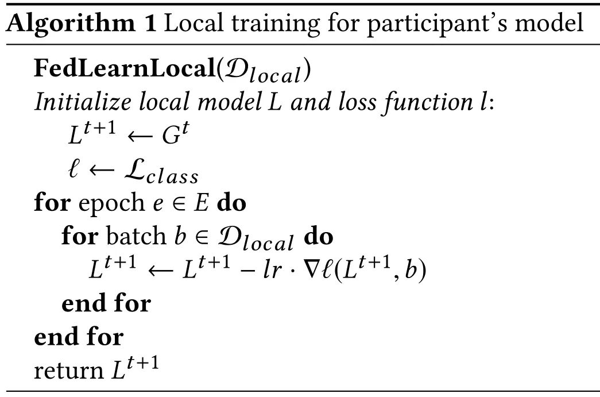

# 文献阅读——联邦学习鲁棒性

> * 上一篇文献阅读主要解决了如何构建联邦学习模型
> * 这一篇文献阅读主要解决联邦学习模型中的问题。包括：
>   * 模型的鲁棒性和安全性问题。（恶意攻击和破坏）
>   * 非独立同分布数据提高准确性、有效性和训练速度
>   * 数据的隐私保护为题。（隐私保护）
>   * 去中心化的联邦学习与模型共享。（在完全对称的联邦学习中的激励机制。）区块链联邦学习，通过区块链交换和验证设备。

## 1 模型攻击：鲁棒性联邦学习研究的最新进展
[参考文献](https://zhuanlan.zhihu.com/p/145657763)
### 问题提出

* 机器学习受到各种对抗攻击。包括数据和模型更新过程中的中毒、模型规避、模型窃取、对用户的私人训练数据进行数据推理攻击。
* 可以分为两大类
  * 定向攻击：对特定类型的样本准确性丢失。后门攻击（Backdoor Attacks），在主要任务中保持较好的性能，在次要任务中表现较差的性能。
  * 非定向攻击：破坏模型整体准确性
  * 模型攻击：被攻击的客户端改变本地模型的更新，从而改变全局模型。
  * 数据攻击：以改变所有训练样本中的一个子集，从而改变全局模型。

### 解决方案

* 安全聚合协议 (Secure Aggregation，SecAgg)：确保服务器无法检查每个用户的更新。

## 2 How To Backdoor Federated Learning——机器之心
[参考文献](https://zhuanlan.zhihu.com/p/145657763)

### 联邦学习模型
$$
L^i-第i轮本地训练模型\\
G^i-第i轮联邦训练模型\\
l-损失函数  \\
epoch-训练集合\\
batch-数据集合\\
\eta-单次学习率\\
m-随机选择的参与者\\
$$

### 联邦学习攻击概述

* 攻击者：控制了一个或者几个参与者，包括本地数据和本地训练过程。
* 攻击目标：攻击者希望通过联邦学习得到一个联合模型，该模型在其主任务和攻击者选择的后门子任务上都能实现高准确度，并且在攻击后的多轮攻击后，在后门子任务上保持高准确度。
* 语义后门：修改样本的数据特征。
* 基线攻击：在每个训练批次中尽量包括正确标记的输入和后门输入的混合，以帮助模型学习识别二者的差异。但中央服务器的聚合操作抵消了后门模型的大部分贡献，
* 模型替换攻击：对后门模型的权重进行放大，抵消原来的模型。
* 改善持久性并规避异常检查。

## 3 Can You Really Backdoor Federated Learning?
[参考文献](https://zhuanlan.zhihu.com/p/145657763)

----

## 4 Local Model Poisoning Attacks to Byzantine-Robust Federated Learning
[参考文献](https://zhuanlan.zhihu.com/p/145657763)

----

## 5 Federated Variance-Reduced Stochastic Gradient Descent with Robustness to Byzantine Attacks
[参考文献](https://zhuanlan.zhihu.com/p/145657763)

----
## 6 怎么通过梯度信息还原训练数据？

[参考文献](https://zhuanlan.zhihu.com/p/184981032)

# 文献阅读——联邦学习隐私安全性
# 文献阅读——联邦学习效率问题