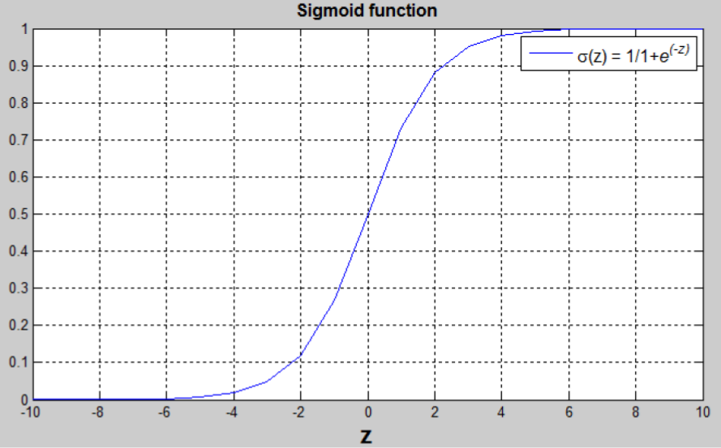
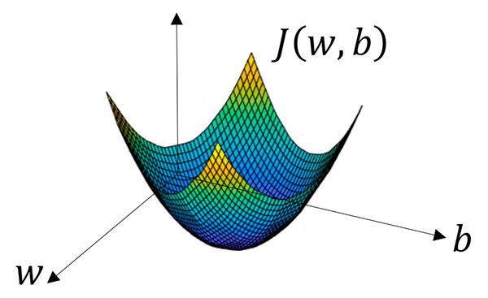
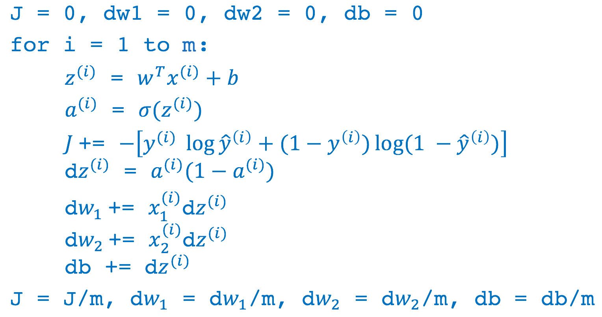

# 神经网络基础


## Logistic 回归

Logistic 回归是一个用于二分分类的算法。

Logistic 回归中使用的参数如下：

* 输入的特征向量：$x \in R^{n\_x}$，其中 ${n\_x}$是特征数量；
* 用于训练的标签：$y \in 0,1$
* 权重：$w \in R^{n\_x}$
* 偏置： $b \in R$
* 输出：$\hat{y} = \sigma(w^Tx+b)$
* Sigmoid 函数：$$s = \sigma(w^Tx+b) = \sigma(z) = \frac{1}{1+e^{-z}}$$

为将 $w^Tx+b$ 约束在 [0, 1] 间，引入 Sigmoid 函数。从下图可看出，Sigmoid 函数的值域为 [0, 1]。



Logistic 回归可以看作是一个非常小的神经网络。下图是一个典型例子：


### 损失函数

**损失函数（loss function）**用于衡量预测结果与真实值之间的误差。

最简单的损失函数定义方式为平方差损失：$$L(\hat{y},y) = \frac{1}{2}(\hat{y}-y)^2$$

但 Logistic 回归中我们并不倾向于使用这样的损失函数，因为之后讨论的优化问题会变成非凸的，最后会得到很多个局部最优解，梯度下降法可能找不到全局最优值。

一般使用$$L(\hat{y},y) = -(y\log\hat{y})-(1-y)\log(1-\hat{y})$$

损失函数是在单个训练样本中定义的，它衡量了在**单个**训练样本上的表现。而**代价函数（cost function，或者称作成本函数）**衡量的是在**全体**训练样本上的表现，即衡量参数 w 和 b 的效果。

$$J(w,b) = \frac{1}{m}\sum_{i=1}^mL(\hat{y}^{(i)},y^{(i)})$$

## 梯度下降法（Gradient Descent）

函数的**梯度（gradient）**指出了函数的最陡增长方向。即是说，按梯度的方向走，函数增长得就越快。那么按梯度的负方向走，函数值自然就降低得最快了。

模型的训练目标即是寻找合适的 w 与 b 以最小化代价函数值。简单起见我们先假设 w 与 b 都是一维实数，那么可以得到如下的 J 关于 w 与 b 的图：



可以看到，成本函数 J 是一个**凸函数**，与非凸函数的区别在于其不含有多个局部最低点；选择这样的代价函数就保证了无论我们初始化模型参数如何，都能够寻找到合适的最优解。

参数 w 的更新公式为：

$$w := w - \alpha\frac{dJ(w, b)}{dw}$$

其中 α 表示学习速率，即每次更新的 w 的步伐长度。

当 w 大于最优解 w′ 时，导数大于 0，那么 w 就会向更小的方向更新。反之当 w 小于最优解 w′ 时，导数小于 0，那么 w 就会向更大的方向更新。迭代直到收敛。

在成本函数 J(w, b) 中还存在参数 b，因此也有：

$$b := b - \alpha\frac{dJ(w, b)}{db}$$

## 计算图（Computation Graph）

神经网络中的计算即是由多个计算网络输出的前向传播与计算梯度的后向传播构成。所谓的 **反向传播（Back Propagation）** 即是当我们需要计算最终值相对于某个特征变量的导数时，我们需要利用计算图中上一步的结点定义。

## Logistic 回归中的梯度下降法

假设输入的特征向量维度为 2，即输入参数共有 x1, w1, x2, w2, b 这五个。可以推导出如下的计算图：


首先反向求出 L 对于 a 的导数：

$$da=\frac{dL(a,y)}{da}=−\frac{y}{a}+\frac{1−y}{1−a}$$

然后继续反向求出 L 对于 z 的导数：

$$dz=\frac{dL}{dz}=\frac{dL(a,y)}{dz}=\frac{dL}{da}\frac{da}{dz}=a−y$$

依此类推求出最终的损失函数相较于原始参数的导数之后，根据如下公式进行参数更新：

$$w _1:=w _1−\alpha dw _1$$

$$w _2:=w _2−\alpha dw _2$$

$$b:=b−\alpha db$$

接下来我们需要将对于单个用例的损失函数扩展到整个训练集的代价函数：

$$J(w,b)=\frac{1}{m}\sum^m_{i=1}L(a^{(i)},y^{(i)})$$ 

$$a^{(i)}=\hat{y}^{(i)}=\sigma(z^{(i)})=\sigma(w^Tx^{(i)}+b)$$

我们可以对于某个权重参数 w1，其导数计算为：

$$\frac{\partial J(w,b)}{\partial{w\_1}}=\frac{1}{m}\sum^m_{i=1}\frac{\partial L(a^{(i)},y^{(i)})}{\partial{w\_1}}$$


完整的 Logistic 回归中某次训练的流程如下，这里仅假设特征向量的维度为 2：



然后对 w1、w2、b 进行迭代。

上述过程在计算时有一个缺点：你需要编写两个 for 循环。第一个 for 循环遍历 m 个样本，而第二个 for 循环遍历所有特征。如果有大量特征，在代码中显式使用 for 循环会使算法很低效。**向量化**可以用于解决显式使用 for 循环的问题。

## 向量化（Vectorization）

在 Logistic 回归中，需要计算 $$z=w^Tx+b$$如果是非向量化的循环方式操作，代码可能如下：

```py
z = 0;
for i in range(n_x):
    z += w[i] * x[i]
z += b
```

而如果是向量化的操作，代码则会简洁很多，并带来近百倍的性能提升（并行指令）：

```py
z = np.dot(w, x) + b
```

不用显式 for 循环，实现 Logistic 回归的梯度下降一次迭代（对应之前蓝色代码的 for 循环部分。这里公式和 NumPy 的代码混杂，注意分辨）：

$$Z=w^TX+b=np.dot(w.T, x) + b$$
$$A=\sigma(Z)$$
$$dZ=A-Y$$
$$dw=\frac{1}{m}XdZ^T$$
$$db=\frac{1}{m}np.sum(dZ)$$
$$w:=w-\sigma dw$$
$$b:=b-\sigma db$$

正向和反向传播尽管如此，多次迭代的梯度下降依然需要 for 循环。

## 广播（broadcasting）

Numpy 的 Universal functions 中要求输入的数组 shape 是一致的。当数组的 shape 不相等的时候，则会使用广播机制，调整数组使得 shape 一样，满足规则，则可以运算，否则就出错。

四条规则：

1. 让所有输入数组都向其中 shape 最长的数组看齐，shape 中不足的部分都通过在前面加 1 补齐；
2. 输出数组的 shape 是输入数组 shape 的各个轴上的最大值；
3. 如果输入数组的某个轴和输出数组的对应轴的长度相同或者其长度为 1 时，这个数组能够用来计算，否则出错；
4. 当输入数组的某个轴的长度为 1 时，沿着此轴运算时都用此轴上的第一组值。

## NumPy 使用技巧

转置对秩为 1 的数组无效。因此，应该避免使用秩为 1 的数组，用 n * 1 的矩阵代替。例如，用`np.random.randn(5,1)`代替`np.random.randn(5)`。

如果得到了一个秩为 1 的数组，可以使用`reshape`进行转换。

