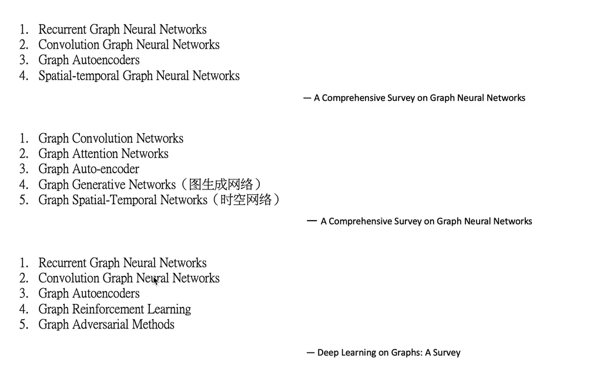
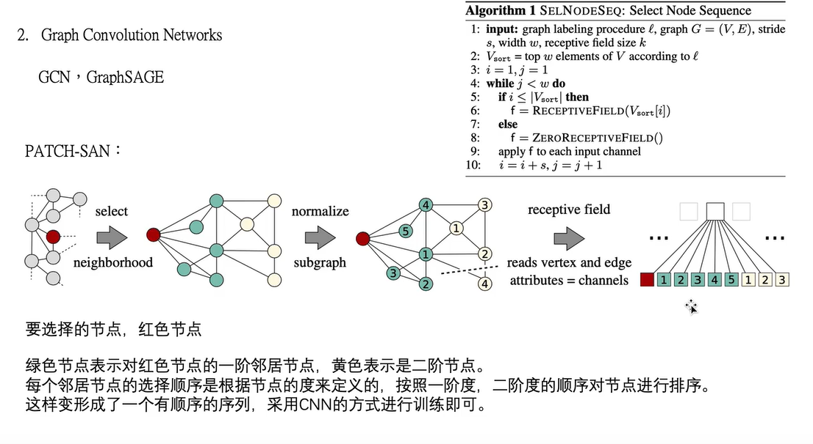
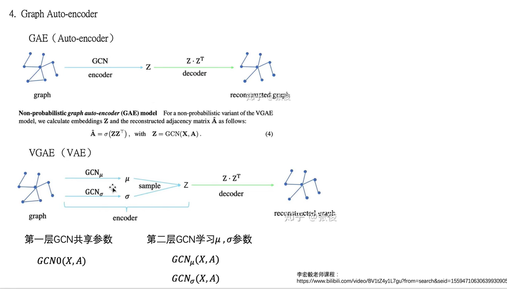
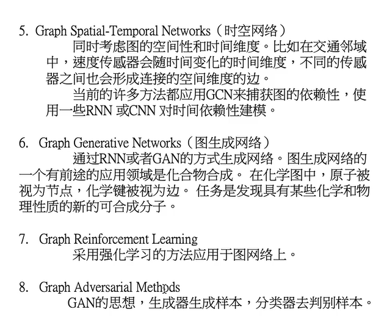
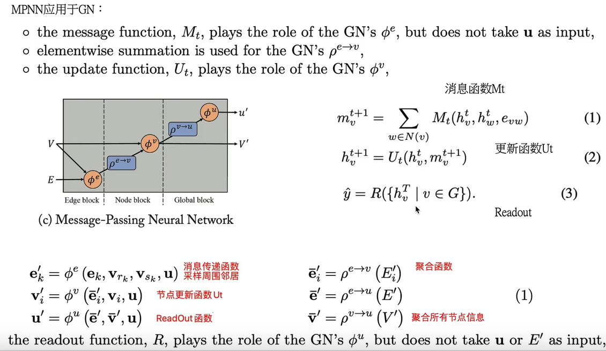
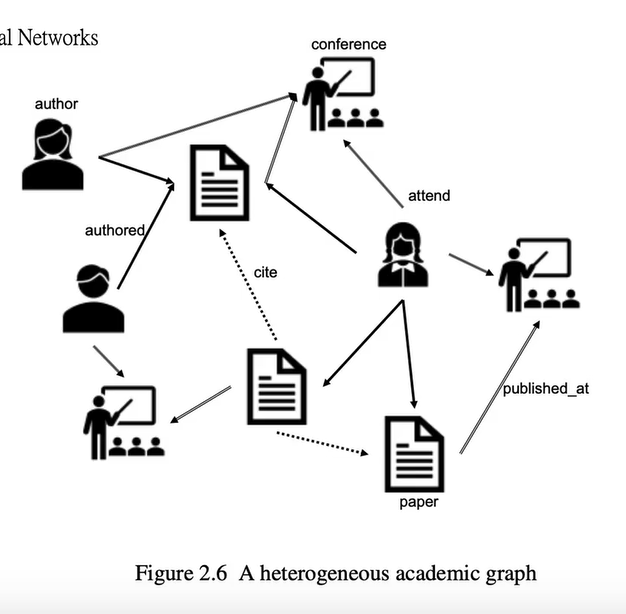
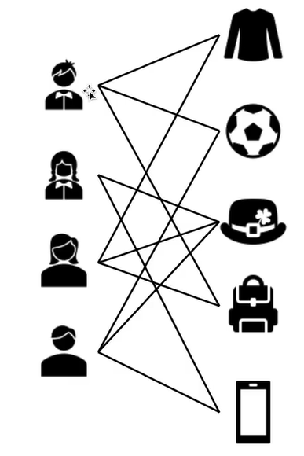
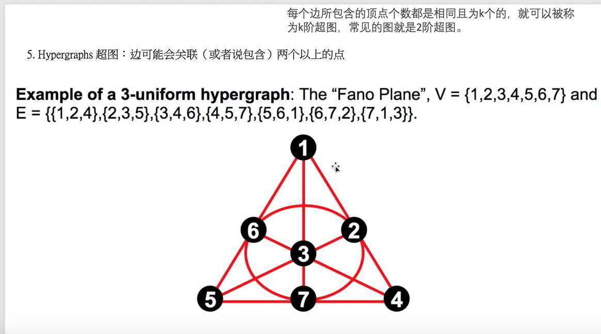
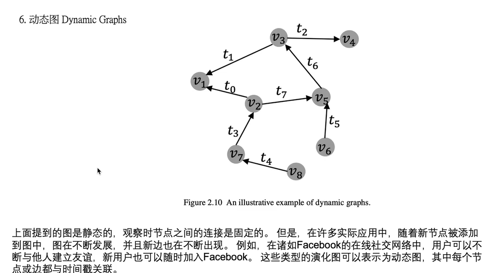

# 图神经网络的分类

## 概述

主要是对图神经网络的综述，包括各种类型的图神经网络。

### 根据神经网络的类型进行分类

* 递归图神经网络

* 卷积图神经网络

* 自编码图神经网络

* 注意力图神经网络

### 根据框架和机制进行分类
* 基于消息传递机制的MPNN。
  * MPNN分两个阶段，消息传递阶段和Readout阶段，readout阶段可以读出整个网络的特征向量，用于图分类，这个很关键。现在缺的两个部分之一。

* 局部图神经网络MLNN

* 图网络GN框架统一了MPNN和MLNN
  * 利用全局信息，更新每个点、每个边。
  * 利用更新后的信息，形成全局的边和点。
  * 利用全局的边和全局的点，构成新的全局信息

### 根据图计算的任务进行分类

* 图计算任务的框架
  * 节点问题
  * 边问题：将两个节点作为输入，输出边的预测
  * 图问题：图分类、图匹配、图生成
* 图上的任务类别
  * 半监督任务Node
  * 有监督任务Graph Node
  * 无监督任务Graph Embedding
* 图的类型
  * 异构图：点和点、边和边之间的关系不一样。节点不同。人和文章
  
  * 二部图：将图中的节点分为两部分。不同部分的节点之间有边连接。但是各部分之间有连接。
  
  * 多维图：边的类型有很多，多重关系组成的图。
  
  * 符号图：边包含两种正负。
  
  * 超图
  
  * 动态图：节点之间的关系是会变化的。
  

