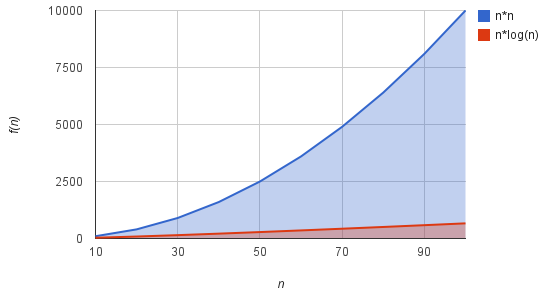
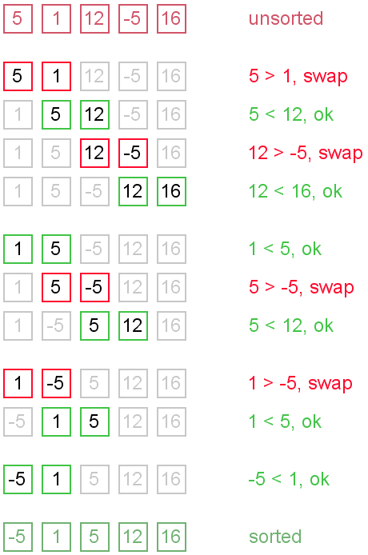
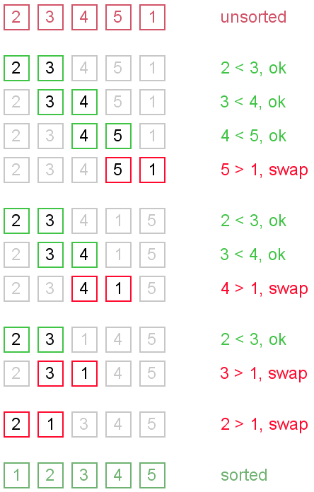
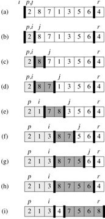
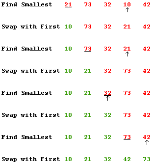
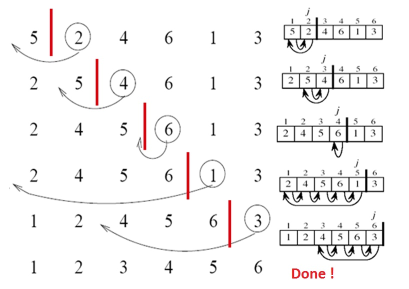
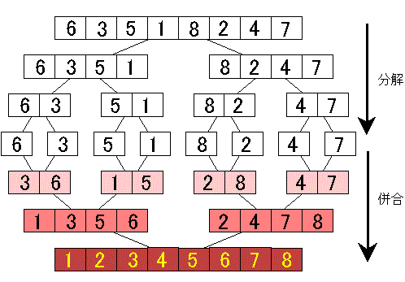

# 排序算法
## 0 比较排序算法分类
比较排序（Comparison Sort）通过对数组中的元素进行比较来实现排序。

<table style="border: 1px solid #000000; background-color: #ffffff; line-height: 10px;" border="1" align="center">
<tbody>
<tr style="background-color: #f8f8f8;" align="left" valign="middle">
<td style="text-align: center;" scope="col" colspan="7" align="left" valign="middle">
<p><span style="font-size: 16px;"><strong>比较排序算法（Comparison Sorts）</strong></span></p>
</td>
</tr>
<tr style="background-color: #f8f8f8;" align="left" valign="middle">
<td scope="col" align="left" valign="middle">
<p style="text-align: center;"><span style="font-size: 16px;"><strong>Category</strong></span></p>
</td>
<td>
<p style="text-align: center;"><span style="font-size: 16px;"><strong>Name</strong></span></p>
</td>
<td>
<p style="text-align: center;"><span style="font-size: 16px;"><strong>Best</strong></span></p>
</td>
<td><span style="font-size: 16px;"><strong>Average</strong></span></td>
<td style="text-align: center;"><span style="font-size: 16px;"><strong>Worst</strong></span></td>
<td style="text-align: center;"><span style="font-size: 16px;"><strong>Memory</strong></span></td>
<td style="text-align: center;"><span style="font-size: 16px;"><strong>Stability</strong></span></td>
</tr>
<tr align="left" valign="middle">
<td scope="col" rowspan="2" align="left" valign="middle">
<p><span style="font-size: 16px;"><strong>&nbsp;插入排序&nbsp;</strong></span></p>
<p><span style="font-size: 12px;"><strong>（Insertion&nbsp;</strong><strong>Sorts）</strong></span></p>
<p><span style="font-size: 16px;">&nbsp;</span></p>
</td>
<td>
<p><span style="font-size: 16px;">&nbsp;<a href="#insertion_sort">插入排序</a></span></p>
<p><span style="font-size: 12px;"><a href="#insertion_sort">（Insertion Sort）</a></span></p>
</td>
<td style="text-align: center;">
<p><span style="font-size: 16px;">n</span></p>
</td>
<td style="text-align: center;">
<p><span style="font-size: 16px;">n<sup>2</sup></span></p>
</td>
<td style="text-align: center;">
<p><span style="font-size: 16px;">n<sup>2</sup></span></p>
</td>
<td style="text-align: center;">
<p><span style="font-size: 16px;">1</span></p>
</td>
<td style="text-align: center;">
<p><span style="font-size: 16px;">Stable</span></p>
</td>
</tr>
<tr align="left" valign="middle">
<td>
<p><span style="font-size: 16px;">&nbsp;<a href="#shell_sort">希尔排序</a></span></p>
<p><span style="font-size: 12px;"><a href="#shell_sort">（Shell Sort）</a></span></p>
</td>
<td style="text-align: center;">
<p><span style="font-size: 16px;">n</span></p>
</td>
<td style="text-align: center;">
<p><span style="font-size: 16px;">n log<sup>2</sup> n</span></p>
</td>
<td style="text-align: center;">
<p><span style="font-size: 16px;">n log<sup>2</sup>&nbsp;n</span></p>
</td>
<td style="text-align: center;">
<p><span style="font-size: 16px;">1</span></p>
</td>
<td style="text-align: center;">
<p><span style="font-size: 16px;">Not Stable</span></p>
</td>
</tr>
<tr align="left" valign="middle">
<td scope="col" rowspan="4" align="left" valign="middle">
<p><span style="font-size: 16px;"><strong>&nbsp;交换排序</strong></span></p>
<p><span style="font-size: 12px;"><strong>（Exchange&nbsp;</strong><strong>Sorts ）</strong></span></p>
<p><span style="font-size: 16px;">&nbsp;</span></p>
<p><span style="font-size: 16px;">&nbsp;</span></p>
<p><span style="font-size: 16px;">&nbsp;</span></p>
</td>
<td>
<p><span style="font-size: 16px;">&nbsp;<a href="#quick_sort">快速排序</a></span></p>
<p><span style="font-size: 12px;"><a href="#quick_sort">（Quick Sort）</a></span></p>
</td>
<td style="text-align: center;">
<p><span style="font-size: 16px;">&nbsp;n log n<br></span></p>
</td>
<td style="text-align: center;">
<p><span style="font-size: 16px;">n log n</span></p>
</td>
<td style="text-align: center;">
<p><span style="font-size: 16px;">n<sup>2</sup></span></p>
</td>
<td style="text-align: center;">
<p><span style="font-size: 16px;">log n</span></p>
</td>
<td style="text-align: center;">
<p><span style="font-size: 16px;">Not Stable</span></p>
</td>
</tr>
<tr align="left" valign="middle">
<td>
<p><span style="font-size: 16px;">&nbsp;<a href="#bubble_sort">冒泡排序</a></span></p>
<p><span style="font-size: 12px;"><a href="#bubble_sort">（Bubble Sort）</a></span></p>
</td>
<td style="text-align: center;">
<p><span style="font-size: 16px;">n</span></p>
</td>
<td style="text-align: center;">
<p><span style="font-size: 16px;">n<sup>2</sup></span></p>
</td>
<td style="text-align: center;">
<p><span style="font-size: 16px;">n<sup>2</sup></span></p>
</td>
<td style="text-align: center;">
<p><span style="font-size: 16px;">1</span></p>
</td>
<td style="text-align: center;">
<p><span style="font-size: 16px;">Stable</span></p>
</td>
</tr>
<tr align="left" valign="middle">
<td>
<p><span style="font-size: 16px;">&nbsp;<a href="#cocktail_sort">鸡尾酒排序</a></span></p>
<p><span style="font-size: 12px;"><a href="#cocktail_sort">（Cocktail Sort）</a></span></p>
</td>
<td style="text-align: center;">
<p><span style="font-size: 16px;">n</span></p>
</td>
<td style="text-align: center;">
<p><span style="font-size: 16px;">n<sup>2</sup></span></p>
</td>
<td style="text-align: center;">
<p><span style="font-size: 16px;">n<sup>2</sup></span></p>
</td>
<td style="text-align: center;">
<p><span style="font-size: 16px;">1</span></p>
</td>
<td style="text-align: center;">
<p><span style="font-size: 16px;">Stable</span></p>
</td>
</tr>
<tr align="left" valign="middle">
<td>
<p><span style="font-size: 16px;">&nbsp;<a href="#odd_even_sort">奇偶排序</a></span></p>
<p><span style="font-size: 12px;"><a href="#odd_even_sort">（Odd-Even Sort）</a></span></p>
</td>
<td style="text-align: center;">
<p><span style="font-size: 16px;">n</span></p>
</td>
<td style="text-align: center;">
<p><span style="font-size: 16px;">n<sup>2</sup></span></p>
</td>
<td style="text-align: center;">
<p><span style="font-size: 16px;">n<sup>2</sup></span></p>
</td>
<td style="text-align: center;">
<p><span style="font-size: 16px;">1</span></p>
</td>
<td style="text-align: center;">
<p><span style="font-size: 16px;">Stable</span></p>
</td>
</tr>
<tr align="left" valign="middle">
<td scope="col" rowspan="2" align="left" valign="middle">
<p><span style="font-size: 16px;"><strong>&nbsp;选择排序</strong></span></p>
<p><span style="font-size: 12px;"><strong>（Selection&nbsp;</strong><strong>Sorts）</strong></span></p>
<p><span style="font-size: 16px;">&nbsp;</span></p>
</td>
<td>
<p><span style="font-size: 16px;">&nbsp;<a href="#selection_sort">选择排序</a></span></p>
<p><span style="font-size: 12px;"><a href="#selection_sort">（Selection Sort）</a></span></p>
</td>
<td style="text-align: center;">
<p><span style="font-size: 16px;">&nbsp;n<sup>2</sup></span></p>
</td>
<td style="text-align: center;">
<p><span style="font-size: 16px;">n<sup>2</sup></span></p>
</td>
<td style="text-align: center;">
<p><span style="font-size: 16px;">n<sup>2</sup></span></p>
</td>
<td style="text-align: center;">
<p><span style="font-size: 16px;">1</span></p>
</td>
<td style="text-align: center;">
<p><span style="font-size: 16px;">Not Stable</span></p>
</td>
</tr>
<tr align="left" valign="middle">
<td>
<p><span style="font-size: 16px;">&nbsp;<a href="#heap_sort">堆排序</a></span></p>
<p><span style="font-size: 12px;"><a href="#heap_sort">（Heap Sort）</a></span></p>
</td>
<td style="text-align: center;">
<p><span style="font-size: 16px;">&nbsp;n log n</span></p>
</td>
<td style="text-align: center;">
<p><span style="font-size: 16px;">n log n</span></p>
</td>
<td style="text-align: center;">
<p><span style="font-size: 16px;">n log n</span></p>
</td>
<td style="text-align: center;">
<p><span style="font-size: 16px;">1</span></p>
</td>
<td style="text-align: center;">
<p><span style="font-size: 16px;">Not Stable</span></p>
</td>
</tr>
<tr align="left" valign="middle">
<td scope="col" align="left" valign="middle">
<p><span style="font-size: 16px;"><strong>&nbsp;合并排序</strong></span></p>
<p><span style="font-size: 12px;"><strong>（Merge&nbsp;</strong><strong>Sorts）</strong></span></p>
</td>
<td>
<p><span style="font-size: 16px;">&nbsp;<a href="#merge_sort">合并排序</a></span></p>
<p><span style="font-size: 12px;"><a href="#merge_sort">（Merge Sort）</a></span></p>
</td>
<td style="text-align: center;">
<p><span style="font-size: 16px;">&nbsp;n</span></p>
</td>
<td style="text-align: center;">
<p><span style="font-size: 16px;">n log n</span></p>
</td>
<td style="text-align: center;">
<p><span style="font-size: 16px;">n log n</span></p>
</td>
<td style="text-align: center;">
<p><span style="font-size: 16px;">n</span></p>
</td>
<td style="text-align: center;">
<p><span style="font-size: 16px;">Stable</span></p>
</td>
</tr>
<tr align="left" valign="middle">
<td scope="col" align="left" valign="middle">
<p><span style="font-size: 16px;"><strong>&nbsp;</strong><strong>混合排序</strong></span></p>
<p><span style="font-size: 12px;"><strong>（Hybrid&nbsp;</strong><strong>Sorts）</strong></span></p>
</td>
<td>
<p><span style="font-size: 16px;">&nbsp;<a href="#intro_sort">内省排序</a></span></p>
<p><span style="font-size: 12px;"><a href="#intro_sort">（Introspective Sort）</a></span></p>
</td>
<td style="text-align: center;">
<p><span style="font-size: 16px;">&nbsp;n log n</span></p>
</td>
<td style="text-align: center;">
<p><span style="font-size: 16px;">n log n</span></p>
</td>
<td style="text-align: center;">
<p><span style="font-size: 16px;">n log n</span></p>
</td>
<td style="text-align: center;">
<p><span style="font-size: 16px;">log n</span></p>
</td>
<td style="text-align: center;">
<p><span style="font-size: 16px;">Not Stable</span></p>
</td>
</tr>
</tbody>
</table>

> 注：关于 Memory，如果算法为 "in place" 排序，则仅需要 O(1) 内存；有时对于额外的 O(log(n)) 内存也可以称为 "in place"。

> 注：Microsoft .NET Framework 中 Array.Sort 方法的实现使用了内省排序（Introspective Sort）算法。


### Stable 与 Not Stable 的比较

* 稳定排序算法会将相等的元素值维持其相对次序。如果一个排序算法是稳定的，当有两个有相等的元素值 R 和 S，且在原本的列表中 R 出现在 S 之前，那么在排序过的列表中 R 也将会是在 S 之前。


### O(n2) 与 O(n*logn) 的比较

* 合并排序和堆排序在最坏情况下达到上界 $O(n*logn)$，快速排序在平均情况下达到上界 $O(n*logn)$。对于比较排序算法，我们都能给出 n 个输入的数值，使算法以 $Ω(n*logn)$ 时间运行。

> 注：有关算法复杂度，可参考文章《算法复杂度分析》。有关常用数据结构的复杂度，可参考文章《常用数据结构及复杂度》。



## 1 冒泡排序（Bubble Sort）
### 算法描述
重复地比较要排序的数列，一次比较两个元素，如果后者较小则与前者交换元素。
1. 比较相邻的元素，如果前者比后者大，则交换两个元素。
2. 对每一对相邻元素作同样的工作，从开始第一对到结尾的最后一对。
3. 针对所有的元素重复以上的步骤，除了最后一个。



### 算法复杂度
冒泡排序对 n 个元素需要 O(n2) 的比较次数，且可以原地排序。冒泡排序仅适用于对于含有较少元素的数列进行排序。
* 最差时间复杂度 O(n2)
* 平均时间复杂度 O(n2)
* 最优时间复杂度 O(n)
* 最差空间复杂度 O(n)，辅助空间 O(1)

### 示例代码
```C++
vector<int> bubble_sort(vector<int> vec){
    for(int i=0;i<vec.size()-1;i++){
        for(int j=0;j<vec.size()-1-i;j++){
            if(vec[j]>vec[j+1]){
                swap(vec[j],vec[j+1]);
            }
        }
    }
    return vec;
}
```

## 2 鸡尾酒排序（Cocktail Sort）

### 算法描述
鸡尾酒排序，也就是双向冒泡排序（Bidirectional Bubble Sort），是冒泡排序的一种变形。此算法与冒泡排序的不同处在于排序时是以双向在序列中进行排序。如果序列中的大部分元素已经排序好时，可以得到比冒泡排序更好的性能。

### 算法复杂度
* 最差时间复杂度 O(n2)
* 平均时间复杂度 O(n2)
* 最优时间复杂度 O(n)
* 最差空间复杂度 О(1)

### 代码示例
```
 1   class Program
 2   {
 3     static void Main(string[] args)
 4     {
 5       int[] unsorted = { 4, 1, 5, 2, 6, 3, 7, 9, 8 };
 6 
 7       OptimizedCocktailSort(unsorted);
 8 
 9       foreach (var key in unsorted)
10       {
11         Console.Write("{0} ", key);
12       }
13 
14       Console.Read();
15     }
16 
17     static void CocktailSort(int[] unsorted)
18     {
19       for (int i = 0; i < unsorted.Length / 2; i++)
20       {
21         // move the larger to right side
22         for (int j = i; j + 1 < unsorted.Length - i; j++)
23         {
24           if (unsorted[j] > unsorted[j + 1])
25           {
26             int temp = unsorted[j];
27             unsorted[j] = unsorted[j + 1];
28             unsorted[j + 1] = temp;
29           }
30         }
31 
32         // move the smaller to left side
33         for (int j = unsorted.Length - i - 1; j > i; j--)
34         {
35           if (unsorted[j - 1] > unsorted[j])
36           {
37             int temp = unsorted[j - 1];
38             unsorted[j - 1] = unsorted[j];
39             unsorted[j] = temp;
40           }
41         }
42       }
43     }
44 
45     static void OptimizedCocktailSort(int[] unsorted)
46     {
47       bool swapped = false;
48       int start = 0;
49       int end = unsorted.Length - 1;
50       do
51       {
52         swapped = false;
53 
54         // move the larger to right side
55         for (int i = start; i < end; i++)
56         {
57           if (unsorted[i] > unsorted[i + 1])
58           {
59             int temp = unsorted[i];
60             unsorted[i] = unsorted[i + 1];
61             unsorted[i + 1] = temp;
62 
63             swapped = true;
64           }
65         }
66 
67         // we can exit the outer loop here if no swaps occurred.
68         if (!swapped) break;
69         swapped = false;
70         end = end - 1;
71 
72         // move the smaller to left side
73         for (int j = end; j > start; j--)
74         {
75           if (unsorted[j - 1] > unsorted[j])
76           {
77             int temp = unsorted[j];
78             unsorted[j] = unsorted[j - 1];
79             unsorted[j - 1] = temp;
80 
81             swapped = true;
82           }
83         }
84 
85         start = start + 1;
86       }
87       while (swapped);
88     }
89   }
```

## 3 奇偶排序（Odd-Even Sort）
### 算法描述
奇偶排序通过比较数组中相邻的（奇-偶）位置元素，如果该奇偶元素对是错误的顺序（前者大于后者），则交换元素。然后再针对所有的（偶-奇）位置元素进行比较。如此交替进行下去。


### 算法复杂度
最差时间复杂度 O(n2)
平均时间复杂度 O(n2)
最优时间复杂度 O(n)
最差空间复杂度 О(1)
### 代码示例
```
 1   class Program
 2   {
 3     static void Main(string[] args)
 4     {
 5       int[] unsorted = { 4, 1, 5, 2, 6, 3, 7, 9, 8 };
 6 
 7       OptimizedOddEvenSort(unsorted);
 8 
 9       foreach (var key in unsorted)
10       {
11         Console.Write("{0} ", key);
12       }
13 
14       Console.Read();
15     }
16 
17     static void OddEvenSort(int[] unsorted)
18     {
19       for (int i = 0; i < unsorted.Length; ++i)
20       {
21         if (i % 2 > 0)
22         {
23           for (int j = 2; j < unsorted.Length; j += 2)
24           {
25             if (unsorted[j] < unsorted[j - 1])
26             {
27               int temp = unsorted[j - 1];
28               unsorted[j - 1] = unsorted[j];
29               unsorted[j] = temp;
30             }
31           }
32         }
33         else
34         {
35           for (int j = 1; j < unsorted.Length; j += 2)
36           {
37             if (unsorted[j] < unsorted[j - 1])
38             {
39               int temp = unsorted[j - 1];
40               unsorted[j - 1] = unsorted[j];
41               unsorted[j] = temp;
42             }
43           }
44         }
45       }
46     }
47 
48     static void OptimizedOddEvenSort(int[] unsorted)
49     {
50       bool swapped = true;
51       int start = 0;
52 
53       while (swapped || start == 1)
54       {
55         swapped = false;
56 
57         for (int i = start; i < unsorted.Length - 1; i += 2)
58         {
59           if (unsorted[i] > unsorted[i + 1])
60           {
61             int temp = unsorted[i];
62             unsorted[i] = unsorted[i + 1];
63             unsorted[i + 1] = temp;
64 
65             swapped = true;
66           }
67         }
68 
69         if (start == 0) start = 1;
70         else start = 0;
71       }
72     }
73   }
```

## 4 快速排序（Quick Sort）
### 基本思想
快速排序使用分治法（Divide-and-Conquer）策略将一个数列分成两个子数列并使用递归来处理。

1. 比如有如下这个 10 个数字，[13, 81, 92, 42, 65, 31, 57, 26, 75, 0]。
2. 随机选择一个数作为中间的元素，例如选择 65。
3. 这样数组就被 65 分成了两部分，左边的都小于 65，右边的都大于 65。
4. 然后分别对左右两边的子数组按照相同的方式进行排序，并最终排序完毕。

### 算法描述
1. 从数列中挑出一个元素，称为 "主元"（pivot）。
2. 重新排序数列，所有元素比主元小的摆放在主元前面，所有元素比主元值大的摆在主元的后面（相同的数可以到任一边）。这个称为分区（partition）操作。在分区退出之后，该主元就处于数列的中间位置。
3. 递归地（recursively）把小于主元值元素的子数列和大于主元值元素的子数列排序。递归的最底部情形，是数列的大小是 0 或 1 ，也就是总是被排序好的状况。这样一直递归下去，直到算法退出。



### 算法实现
下面的过程实现快速排序，调用 QUICKSORT(A, 1, length[A])。
```
1 QUICKSORT(A, p, r)
2     if p < r
3         then q <- PARTITION(A, p, r)
4             QUICKSORT(A, p, q - 1)
5             QUICKSORT(A, q + 1, r)
```
快速排序算法的关键是 Partition 过程，它对子数组进行就是重排。
```
1 PARTITION(A, p, r)
2     x <- A[r]
3     i <- p - 1
4     for j <- p to r - 1
5         do if A[j] <= x
6             then i <- i + 1
7                 exchange A[i] <-> A[j]
8     exchange A[i + 1] <-> A[r]
9     return  i + 1
```
### 算法复杂度
* 最差时间复杂度 O(n2)
* 平均时间复杂度 O(n*log n)
* 最优时间复杂度 O(n*log n)
* 最差空间复杂度 根据实现的方式不同而不同 O(n) 辅助空间 O(log n)


快速排序的运行时间与划分是否对称有关，而后者又与选择了哪一个元素来进行划分有关。如果划分是对称的，那么快速排序从渐进意义上来讲，就与合并算法一样快；如果划分是不对称的，那么从渐进意义上来讲，就与插入排序一样慢。

快速排序的平均运行时间与其最佳情况运行时间很接近，而不是非常接近于最差情况运行时间。

QUICKSORT 的运行时间是由花在过程 PARTITION 上的时间所决定的。每当 PARTITION 过程被调用时，就要选出一个 Pivot 元素。后续对 QUICKSORT 和 PARTITION 的各次递归调用中，都不会包含该元素。于是，在快速排序算法的整个执行过程中，至多只可能调用 PARTITION 过程 n 次。

### 快速排序的随机化版本
快速排序的随机化版本是对足够大的输入的理想选择。

RANDOMIZED-QUICKSORT 的平均运行情况是 O(n lg n)，如果在递归的每一层上，RANDOMIZED-PARTITION 所作出的划分使任意固定量的元素偏向划分的某一边，则算法的递归树深度为 Θ(lg n)，且在每一层上所做的工作量都为 O(n)。
```
1 RANDOMIZED-PARTITION(A, p, r)
2     i <- RANDOM(p, r)
3     exchange A[r] <-> A[i]
4     return PARTITION(A, p, r)
```

### 算法比较
快速排序是二叉查找树的一个空间优化版本。但其不是循序地把数据项插入到一个显式的树中，而是由快速排序组织这些数据项到一个由递归调用所隐含的树中。这两个算法完全地产生相同的比较次数，但是顺序不同。

快速排序的最直接竞争者是堆排序（Heap Sort）。堆排序通常会慢于原地排序的快速排序，其最坏情况的运行时间总是 O(n log n) 。快速排序通常情况下会比较快，但仍然有最坏情况发生的机会。

快速排序也会与合并排序（Merge Sort）竞争。合并排序的特点是最坏情况有着 O(n log n) 运行时间的优势。不像快速排序或堆排序，合并排序是一个稳定排序算法，并且非常的灵活，其设计可以应用于操作链表，或大型链式存储等，例如磁盘存储或网路附加存储等。尽管快速排序也可以被重写使用在链表上，但对于基准的选择总是个问题。合并排序的主要缺点是在最佳情况下需要 O(n) 额外的空间，而快速排序的原地分区和尾部递归仅使用 O(log n) 的空间。

### 代码示例
```C++
// 快速排序
int partion(vector<int>&vec, int left, int right){
    int index = right;
    // 哨兵
    int sentinel = vec[index];
    // 子数组长度为 right - left + 1
    int i = left;
    // 从左到右，小的与前边交换。大的就会到右边。
    for (int j = left; j <= right - 1; j++)
    {
        if (vec[j] <= sentinel)
        {
            swap(vec[i],vec[j]);
            i++;
        }
    }
    swap(vec[i],vec[index]);
    return i;
}
// 非常巧妙的避免了sentinel是最大值时存在的不交换陷阱。
vector<int> quick_sort(vector<int> &vec,int left,int right){
    if(left>=right)return;
    int index = partion(vec,left,right);
    quick_sort(vec,left,index-1);
    quick_sort(vec,index+1,right);
    return vec;
}
```


## 5 选择排序（Selection Sort）
### 算法原理
首先在未排序序列中找到最小（大）元素，存放到排序序列的起始位置，然后，再从剩余未排序元素中继续寻找最小（大）元素，然后放到已排序序列的末尾。以此类推，直到所有元素均排序完毕。


### 算法复杂度
选择排序的交换操作介于 0 和 (n-1) 次之间。选择排序的比较操作为 n(n-1)/2 次之间。选择排序的赋值操作介于 0 和 3(n-1) 次之间。

比较次数 O(n2)，比较次数与关键字的初始状态无关，总的比较次数 N = (n-1)+(n-2)+...+1 = n*(n-1)/2。交换次数 O(n)，最好情况是，已经有序，交换 0 次；最坏情况是，逆序，交换 n-1 次。交换次数比冒泡排序较少，由于交换所需 CPU 时间比比较所需的 CPU 时间多，n 值较小时，选择排序比冒泡排序快。

原地操作几乎是选择排序的唯一优点，当空间复杂度（space complexity）要求较高时，可以考虑选择排序，实际适用的场合非常罕见。

* 最差时间复杂度 О(n²)
* 平均时间复杂度 О(n²)
* 最优时间复杂度 О(n²)
* 最差空间复杂度 О(n)，辅助空间 O(1)

### 代码示例
```C++
vector<int> selection_sort(vector<int> vec){
    int min=INT_MAX,min_index=0;
    int i=0,j=0;
    for(i=0;i<vec.size()-1;i++){
        min=INT_MAX;
        for(j=i;j<vec.size();j++){
            if(vec[j]<min){
                min = vec[j];
                min_index=j;
            }
        }
        swap(vec[i],vec[j]);
    }
}
```

## 6 插入排序（Insertion Sort）
### 算法原理
对于未排序数据，在已排序序列中从后向前扫描，找到相应位置，将位置后的已排序数据逐步向后挪位，将新元素插入到该位置。


### 算法描述
1. 从第一个元素开始，该元素可以认为已经被排序；
2. 取出下一个元素，在已经排序的元素序列中从后向前扫描；
3. 如果该元素（已排序）大于新元素，将该元素移到下一位置；
4. 重复步骤 3，直到找到已排序的元素小于或者等于新元素的位置；
5. 将新元素插入到该位置后；
6. 重复步骤 2~5；

### 算法复杂度
* In-Place 原地排序（即只需要用到 O(1) 的额外空间）
* 最差时间复杂度 O(n2)
* 平均时间复杂度 O(n2)
* 最优时间复杂度 O(n)
* 最差空间复杂度 O(n)，辅助空间 O(1)

插入排序算法的内循环是紧密的，对小规模输入来说是一个快速的原地排序算法。

### 示例代码
```C++
vector<int> insertion_sort(vector<int> vec){
    for(int i=1;i<vec.size();i++){
        int temp = vec[i];
        int j;
        for(j=i;j>0;j--){            
            if(vec[j-1]>temp){
                vec[j]=vec[j-1];
            }
            else{
                break;
            }
        }
        vec[j]=temp;
    }
    return vec;
}
```

## 7 希尔排序（Shell Sort）
### 算法原理
希尔排序是插入排序的一种更高效的改进版本，其基于插入排序的以下两个特点提出改进方法：
* 插入排序在对几乎已经排序的数据操作时，效率高，可以达到线性时间。
* 插入排序一般来说是低效的，其每次只能将数据移动一位。

### 算法描述
希尔排序通过将比较的全部元素分为几个区域来提升插入排序的性能。这样可以让一个元素一次性地朝最终位置前进一大步。然后算法再取越来越小的步长进行排序，算法的最后一步就是普通的插入排序，但是到了这步，需排序的数据几乎是已排好的了，此时插入排序较快。

假设有一个很小的数据在一个已按升序排好序的数组的末端。如果用复杂度为 O(n2) 的排序（冒泡排序或插入排序），可能会进行 n 次的比较和交换才能将该数据移至正确位置。而希尔排序会用较大的步长移动数据，所以小数据只需进行少量比较和交换即可移到正确位置。


### 步长序列（Gap Sequences）
步长的选择是希尔排序的重要部分。只要最终步长为 1 任何步长串行都可以工作。算法最开始以一定的步长进行排序。然后会继续以一定步长进行排序，最终算法以步长为 1 进行排序。当步长为 1 时，算法变为插入排序，这就保证了数据一定会被排序。

已知的最好步长串行是由 Sedgewick 提出的 (1, 5, 19, 41, 109,...)，该步长的项来自 9 * 4^i - 9 * 2^i + 1 和 4^i - 3 * 2^i + 1 这两个算式。这项研究也表明 "比较在希尔排序中是最主要的操作，而不是交换。" 用这样步长串行的希尔排序比插入排序和堆排序都要快，甚至在小数组中比快速排序还快，但是在涉及大量数据时希尔排序还是比快速排序慢。

### 算法复杂度
* 最差时间复杂度 O(nlog2 n)
* 平均时间复杂度 依赖于步长间隔 O(nlog2 n)
* 最优时间复杂度 O(nlogn)
* 最差空间复杂度 O(n)，辅助空间 O(1)

### 代码示例
```
 1   class Program
 2   {
 3     static void Main(string[] args)
 4     {
 5       int[] unsorted = { 4, 1, 5, 2, 6, 3, 7, 9, 8 };
 6 
 7       ShellSort(unsorted);
 8 
 9       foreach (var key in unsorted)
10       {
11         Console.Write("{0} ", key);
12       }
13 
14       Console.Read();
15     }
16 
17     static void ShellSort(int[] unsorted)
18     {
19       int gap = (int)Math.Ceiling(unsorted.Length / 2D);
20 
21       // start with the largest gap and work down to a gap of 1 
22       while (gap > 0)
23       {
24         // do a gapped insertion sort for this gap size.
25         // the first gap elements a[0..gap-1] are already in gapped order
26         // keep adding one more element until the entire array is gap sorted 
27         for (int i = 0; i < unsorted.Length; i++)
28         {
29           // add a[i] to the elements that have been gap sorted
30           // save a[i] in temp and make a hole at position i
31           int j = i;
32           int temp = unsorted[i];
33 
34           // shift earlier gap-sorted elements up 
35           // until the correct location for a[i] is found
36           while (j >= gap && unsorted[j - gap] > temp)
37           {
38             unsorted[j] = unsorted[j - gap];
39             j = j - gap;
40           }
41 
42           // put temp (the original a[i]) in its correct location
43           unsorted[j] = temp;
44         }
45 
46         // change gap
47         gap = (int)Math.Floor(0.5 + gap / 2.2);
48       }
49     }
50   }
```

## 8 合并排序（Merge Sort）
### 算法原理
合并排序是分治法的典型应用。
分治法（Divide-and-Conquer）：将原问题划分成 n 个规模较小而结构与原问题相似的子问题；递归地解决这些问题，然后再合并其结果，就得到原问题的解。
分治模式在每一层上都有三个步骤：
1. 分解（Divide）：将原问题分解成一系列子问题；
3. 解决（Conquer）：递归地解决各个子问题。若子问题足够小，则直接求解；
3. 合并（Combine）：将子问题的结果合并成原问题的解。

合并排序算法完全依照了上述模式：
1. 分解：将 n 个元素分成各含 n/2 个元素的子序列；
2. 解决：用合并排序法对两个子序列递归地排序；
3. 合并：合并两个已排序的子序列以得到排序结果。



### 算法描述
1. 申请空间，使其大小为两个已经排序序列之和，该空间用来存放合并后的序列；
2. 设定两个指针，最初位置分别为两个已经排序序列的起始位置；
3. 比较两个指针所指向的元素，选择相对小的元素放入到合并空间，并移动指针到下一位置；
4. 重复步骤 3 直到某一指针到达序列尾；
5. 将另一序列剩下的所有元素直接复制到合并序列尾；

### 算法复杂度
* 最差时间复杂度 Θ(n*logn)
* 平均时间复杂度 Θ(n*logn)
* 最优时间复杂度 Θ(n)
* 最差空间复杂度 Θ(n)
* 合并排序有着较好的渐进运行时间 Θ(nlogn)，但其中的 merge 操作不是 in-place 操作。

### 示例代码
```C++
// 归并排序
void merge(vector<int> &vec,int left,int right,int mid){
    vector<int> temp(vec);
    int left_index=left;
    int right_index = mid+1;
    int i=left;
    while(left_index<=mid && right_index<=right){
        if(temp[left_index]<=temp[right_index]){
            vec[i++]=temp[left_index++];
        }
        else{
            vec[i++]=temp[right_index++];
        }
    }
    // 处理左边没有用完的数据。（右边没有用完的可以保留在原地
    while(left_index<=mid){
        vec[i++]=temp[left_index++];
    }
    return;
}
// 头递归
void merge_sort(vector<int> &vec,int left,int right){
    if(left>=right)return;
    // divide
    int mid = (left+right)/2;
    // conquer
    merge_sort(vec,left,mid);
    merge_sort(vec,mid+1,right);
    // combine
    merge(vec,left,right,mid);
    return;
}
```

## 9 堆排序（Heap Sort）

### 算法原理

堆排序（Heap Sort）是指利用堆这种数据结构所设计的一种排序算法。二叉堆数据结构是一种数组对象，它可以被视为一棵完全二叉树。树中每个节点与数组中存放该节点值的那个元素对应。

二叉堆有两种，最大堆和最小堆。最大堆特性是指除了根以外的每个节点 i ，有 A(Parent(i)) ≥ A[i] ，即某个节点的值至多是和其父节点的值一样大。最小堆特性是指除了根以外的每个节点 i ，有 A(Parent(i)) ≤ A[i] ，最小堆的最小元素在根部。

在堆排序算法中，我们使用的是最大堆。最小堆通常在构造优先队列时使用。

堆可以被看成一棵树，节点在堆中的高度定义为从本节点到叶子的最长简单下降路径上边的数目；定义堆的高度为树根的高度。因为具有 n 个元素的堆是基于一棵完全二叉树，因而其高度为 Θ(lg n) 。


### 堆节点的访问
通常堆是通过一维数组来实现的。在数组起始为 0 的情形中，如果 i 为当前节点的索引，则有
* 父节点在位置 floor((i-1)/2)；
* 左子节点在位置 (2*i+1)；
* 右子节点在位置 (2*i+2)；

### 堆的操作
在堆的数据结构中，堆中的最大值总是位于根节点。堆中定义以下几种操作：
* 最大堆调整（Max-Heapify）：将堆的末端子节点作调整，使得子节点永远小于父节点，保持最大堆性质的关键。运行时间为 O(lg n)。
* 创建最大堆（Build-Max-Heap）：在无序的输入数组基础上构造出最大堆。运行时间为 O(n)。
* 堆排序（HeapSort）：对一个数组进行原地排序，卸载位在第一个数据的根节点，并做最大堆调整的递归运算。运行时间为 O(n*lg n)。
* 抽取最大值（Extract-Max）：相当于执行一次最大堆调整，最大值在根处。运行时间为 O(lg n)。

### 算法描述
1. 初始时把要排序的数的序列看作是一棵顺序存储的二叉树，调整它们的存储序，使之成为一个 堆，这时堆的根节点的数最大
2. 然后将根节点与堆的最后一个节点交换。然后对前面(n-1)个数重新调整使之成为堆
3. 依此类推，直到只有两个节点的堆，并对 它们作交换，最后得到有n个节点的有序序列
### 算法复杂度
* 最差时间复杂度 O(n*logn)
* 平均时间复杂度 Θ(n*logn)
* 最优时间复杂度 O(n*logn)
* 最差空间复杂度 O(n)，辅助空间 O(1)

### 示例代码
```C++
// 堆排序
// 向下调整
void shift_down(vector<int> &vec,int pos,int end){
    // 不是最后的非叶节点，直接返回
    if(pos>(end-1)/2)return;
    int left = 2*pos+1;
    int right = 2*pos+2;
    int max;
    // 超出范围，说明是最后一个非叶节点只有一个叶节点
    // 找到两个节点中最大的那个
    if(right>end || vec[left]>vec[right]){
        max=left;
    }
    else{
        max=right;
    }
    // 进行一次下降操作
    if(vec[max]>vec[pos]){
        swap(vec[max],vec[pos]);
    }
    // 下一层的下降
    shift_down(vec,max,end);
}

void heap_sort(vector<int> &vec){
    int end = vec.size()-1;
    // 从最后一个非页节点开始向下调整。到最后一个节点
    for(int i=(end-1)/2;i>=0;i--){
        shift_down(vec,i,end);
    }
    swap(vec[0],vec[end]);
    end--;
    while(end>0){
        // 从根节点开始向下调整到最后一个叶节点。
        shift_down(vec,0,end);        
        // 交换根节点和最后一个叶子节点
        swap(vec[0],vec[end]);
        end--;
    }
    return;
}
```

## 9 内省排序（Introspective Sort）
### 算法原理

内省排序（Introsort）是由 David Musser 在 1997 年设计的排序算法。这个排序算法首先从快速排序开始，当递归深度超过一定深度（深度为排序元素数量的对数值）后转为堆排序。采用这个方法，内省排序既能在常规数据集上实现快速排序的高性能，又能在最坏情况下仍保持 O(nlog n) 的时间复杂度。由于这两种算法都属于比较排序算法，所以内省排序也是一个比较排序算法。

在快速排序算法中，一个关键操作就是选择主元（Pivot）：数列将被此主元位置分开成两部分。最简单的主元选择算法是使用第一个或者最后一个元素，但这在排列已部分有序的序列上性能很差。Niklaus Wirth 为此设计了一个快速排序的变体，使用处于中间的元素来防止在某些特定序列上性能退化为 O(n2) 的状况。该 median-of-3 选择算法从序列的第一、中间和最后一个元素取得中位数来作为主元。虽然这个算法在现实世界的数据上性能表现良好，但经过精心设计的序列仍能大幅降低此算法性能。这样就有攻击者精心设计序列发送到因特网服务器以进行拒绝服务（DOS：Denial of Service）攻击的潜在可能性。


Musser 研究指出，在为 median-of-3 选择算法精心设计的 100,000 个元素序列上，内省排序算法的运行时间是快速排序的 1/200。在 Musser 的算法中，最终较小范围内数据的排序由 Robert Sedgewick 提出的小数据排序算法完成。

### 算法复杂度
* 最差时间复杂度 O(n*log n)
* 平均时间复杂度 O(n*log n)
* 最优时间复杂度 O(n*log n)

### 代码示例
```
  1   class Program
  2   {
  3     static void Main(string[] args)
  4     {
  5       int[] unsorted = { 
  6                          4, 1, 5, 2, 6, 3, 7, 9, 8, 10,
  7                          20, 11, 19, 12, 18, 17, 15, 16, 13, 14
  8                        };
  9 
 10       GenericQuickSorter<int>.DepthLimitedQuickSort(
 11         unsorted, 0, unsorted.Length - 1, 
 12         GenericQuickSorter<int>.QuickSortDepthThreshold);
 13 
 14       foreach (var key in unsorted)
 15       {
 16         Console.Write("{0} ", key);
 17       }
 18 
 19       Console.Read();
 20     }
 21   }
 22 
 23   internal class GenericQuickSorter<T>
 24       where T : IComparable<T>
 25   {
 26     internal const int QuickSortDepthThreshold = 32;
 27 
 28     internal static void DepthLimitedQuickSort(T[] keys, int left, int right, int depthLimit)
 29     {
 30       do
 31       {
 32         if (depthLimit == 0)
 33         {
 34           Heapsort(keys, left, right);
 35           return;
 36         }
 37 
 38         int i = left;
 39         int j = right;
 40 
 41         // pre-sort the low, middle (pivot), and high values in place.
 42         // this improves performance in the face of already sorted data, or 
 43         // data that is made up of multiple sorted runs appended together.
 44         int middle = i + ((j - i) >> 1);
 45         SwapIfGreater(keys, i, middle);  // swap the low with the mid point
 46         SwapIfGreater(keys, i, j);       // swap the low with the high
 47         SwapIfGreater(keys, middle, j);  // swap the middle with the high
 48 
 49         T x = keys[middle];
 50         do
 51         {
 52           while (keys[i].CompareTo(x) < 0) i++;
 53           while (x.CompareTo(keys[j]) < 0) j--;
 54           Contract.Assert(i >= left && j <= right,
 55             "(i>=left && j<=right)  Sort failed - Is your IComparer bogus?");
 56 
 57           if (i > j) break;
 58           if (i < j)
 59           {
 60             T key = keys[i];
 61             keys[i] = keys[j];
 62             keys[j] = key;
 63           }
 64           i++;
 65           j--;
 66         } while (i <= j);
 67 
 68         // The next iteration of the while loop is to 
 69         // "recursively" sort the larger half of the array and the
 70         // following calls recrusively sort the smaller half.  
 71         // So we subtrack one from depthLimit here so
 72         // both sorts see the new value.
 73         depthLimit--;
 74 
 75         if (j - left <= right - i)
 76         {
 77           if (left < j) DepthLimitedQuickSort(keys, left, j, depthLimit);
 78           left = i;
 79         }
 80         else
 81         {
 82           if (i < right) DepthLimitedQuickSort(keys, i, right, depthLimit);
 83           right = j;
 84         }
 85       } while (left < right);
 86     }
 87 
 88     private static void SwapIfGreater(T[] keys, int a, int b)
 89     {
 90       if (a != b)
 91       {
 92         if (keys[a] != null && keys[a].CompareTo(keys[b]) > 0)
 93         {
 94           T key = keys[a];
 95           keys[a] = keys[b];
 96           keys[b] = key;
 97         }
 98       }
 99     }
100 
101     private static void Heapsort(T[] keys, int lo, int hi)
102     {
103       Contract.Requires(keys != null);
104       Contract.Requires(lo >= 0);
105       Contract.Requires(hi > lo);
106       Contract.Requires(hi < keys.Length);
107 
108       int n = hi - lo + 1;
109       for (int i = n / 2; i >= 1; i = i - 1)
110       {
111         DownHeap(keys, i, n, lo);
112       }
113       for (int i = n; i > 1; i = i - 1)
114       {
115         Swap(keys, lo, lo + i - 1);
116         DownHeap(keys, 1, i - 1, lo);
117       }
118     }
119 
120     private static void DownHeap(T[] keys, int i, int n, int lo)
121     {
122       Contract.Requires(keys != null);
123       Contract.Requires(lo >= 0);
124       Contract.Requires(lo < keys.Length);
125 
126       T d = keys[lo + i - 1];
127       int child;
128       while (i <= n / 2)
129       {
130         child = 2 * i;
131         if (child < n
132           && (keys[lo + child - 1] == null
133             || keys[lo + child - 1].CompareTo(keys[lo + child]) < 0))
134         {
135           child++;
136         }
137         if (keys[lo + child - 1] == null
138           || keys[lo + child - 1].CompareTo(d) < 0)
139           break;
140         keys[lo + i - 1] = keys[lo + child - 1];
141         i = child;
142       }
143       keys[lo + i - 1] = d;
144     }
145 
146     private static void Swap(T[] a, int i, int j)
147     {
148       if (i != j)
149       {
150         T t = a[i];
151         a[i] = a[j];
152         a[j] = t;
153       }
154     }
155   }
.NET Array.Sort 实现
微软 .NET 框架中 Array.Sort 方法的实现使用了内省排序（Introspective Sort）算法：
当分区大小（Partition Size）小于 16 个元素时，使用插入排序（Insertion Sort）算法。
当分区的数量超过 2 * LogN 时，N 是输入数组的范围，使用堆排序（Heapsort）算法。
否则，使用快速排序（Quicksort）算法。
这种实现也是不稳定的排序，也就是说，如果两个元素相等，则并不能保证它们的顺序，而相反一个稳定的排序算法则会保持相等元素原来的顺序。
如果数组的长度为 n ，则该实现的平均情况为 O(n log n) ，最坏情况为 O(n2)。
注：.NET 4.5 中使用这里描述的算法，而 .NET 4.0 及以前版本使用上面描述的快速排序和堆排序组合的内省排序算法。
  1   class Program
  2   {
  3     static void Main(string[] args)
  4     {
  5       int[] unsorted = { 
  6                          4, 1, 5, 2, 6, 3, 7, 9, 8, 10,
  7                          20, 11, 19, 12, 18, 17, 15, 16, 13, 14
  8                        };
  9 
 10       GenericIntroSorter<int>.IntrospectiveSort(unsorted, 0, unsorted.Length);
 11 
 12       foreach (var key in unsorted)
 13       {
 14         Console.Write("{0} ", key);
 15       }
 16 
 17       Console.Read();
 18     }
 19   }
 20 
 21   internal class GenericIntroSorter<T>
 22       where T : IComparable<T>
 23   {
 24     internal const int IntrosortSwitchToInsertionSortSizeThreshold = 16;
 25 
 26     internal static void IntrospectiveSort(T[] keys, int left, int length)
 27     {
 28       Contract.Requires(keys != null);
 29       Contract.Requires(left >= 0);
 30       Contract.Requires(length >= 0);
 31       Contract.Requires(length <= keys.Length);
 32       Contract.Requires(length + left <= keys.Length);
 33 
 34       if (length < 2)
 35         return;
 36 
 37       IntroSort(keys, left, length + left - 1, 2 * FloorLog2(keys.Length));
 38     }
 39 
 40     private static void IntroSort(T[] keys, int lo, int hi, int depthLimit)
 41     {
 42       Contract.Requires(keys != null);
 43       Contract.Requires(lo >= 0);
 44       Contract.Requires(hi < keys.Length);
 45 
 46       while (hi > lo)
 47       {
 48         int partitionSize = hi - lo + 1;
 49         if (partitionSize <= IntrosortSwitchToInsertionSortSizeThreshold)
 50         {
 51           if (partitionSize == 1)
 52           {
 53             return;
 54           }
 55           if (partitionSize == 2)
 56           {
 57             SwapIfGreaterWithItems(keys, lo, hi);
 58             return;
 59           }
 60           if (partitionSize == 3)
 61           {
 62             SwapIfGreaterWithItems(keys, lo, hi - 1);
 63             SwapIfGreaterWithItems(keys, lo, hi);
 64             SwapIfGreaterWithItems(keys, hi - 1, hi);
 65             return;
 66           }
 67 
 68           InsertionSort(keys, lo, hi);
 69           return;
 70         }
 71 
 72         if (depthLimit == 0)
 73         {
 74           Heapsort(keys, lo, hi);
 75           return;
 76         }
 77         depthLimit--;
 78 
 79         int p = PickPivotAndPartition(keys, lo, hi);
 80 
 81         // Note we've already partitioned around the pivot 
 82         // and do not have to move the pivot again.
 83         IntroSort(keys, p + 1, hi, depthLimit);
 84         hi = p - 1;
 85       }
 86     }
 87 
 88     private static int PickPivotAndPartition(T[] keys, int lo, int hi)
 89     {
 90       Contract.Requires(keys != null);
 91       Contract.Requires(lo >= 0);
 92       Contract.Requires(hi > lo);
 93       Contract.Requires(hi < keys.Length);
 94       Contract.Ensures(Contract.Result<int>() >= lo && Contract.Result<int>() <= hi);
 95 
 96       // Compute median-of-three.  But also partition them.
 97       int middle = lo + ((hi - lo) / 2);
 98 
 99       // Sort lo, mid and hi appropriately, then pick mid as the pivot.
100       SwapIfGreaterWithItems(keys, lo, middle);  // swap the low with the mid point
101       SwapIfGreaterWithItems(keys, lo, hi);      // swap the low with the high
102       SwapIfGreaterWithItems(keys, middle, hi);  // swap the middle with the high
103 
104       T pivot = keys[middle];
105       Swap(keys, middle, hi - 1);
106 
107       // We already partitioned lo and hi and put the pivot in hi - 1.  
108       // And we pre-increment & decrement below.
109       int left = lo, right = hi - 1;
110 
111       while (left < right)
112       {
113         if (pivot == null)
114         {
115           while (left < (hi - 1) && keys[++left] == null) ;
116           while (right > lo && keys[--right] != null) ;
117         }
118         else
119         {
120           while (pivot.CompareTo(keys[++left]) > 0) ;
121           while (pivot.CompareTo(keys[--right]) < 0) ;
122         }
123 
124         if (left >= right)
125           break;
126 
127         Swap(keys, left, right);
128       }
129 
130       // Put pivot in the right location.
131       Swap(keys, left, (hi - 1));
132 
133       return left;
134     }
135 
136     private static void Heapsort(T[] keys, int lo, int hi)
137     {
138       Contract.Requires(keys != null);
139       Contract.Requires(lo >= 0);
140       Contract.Requires(hi > lo);
141       Contract.Requires(hi < keys.Length);
142 
143       int n = hi - lo + 1;
144       for (int i = n / 2; i >= 1; i = i - 1)
145       {
146         DownHeap(keys, i, n, lo);
147       }
148       for (int i = n; i > 1; i = i - 1)
149       {
150         Swap(keys, lo, lo + i - 1);
151         DownHeap(keys, 1, i - 1, lo);
152       }
153     }
154 
155     private static void DownHeap(T[] keys, int i, int n, int lo)
156     {
157       Contract.Requires(keys != null);
158       Contract.Requires(lo >= 0);
159       Contract.Requires(lo < keys.Length);
160 
161       T d = keys[lo + i - 1];
162       int child;
163       while (i <= n / 2)
164       {
165         child = 2 * i;
166         if (child < n
167           && (keys[lo + child - 1] == null
168             || keys[lo + child - 1].CompareTo(keys[lo + child]) < 0))
169         {
170           child++;
171         }
172         if (keys[lo + child - 1] == null
173           || keys[lo + child - 1].CompareTo(d) < 0)
174           break;
175         keys[lo + i - 1] = keys[lo + child - 1];
176         i = child;
177       }
178       keys[lo + i - 1] = d;
179     }
180 
181     private static void InsertionSort(T[] keys, int lo, int hi)
182     {
183       Contract.Requires(keys != null);
184       Contract.Requires(lo >= 0);
185       Contract.Requires(hi >= lo);
186       Contract.Requires(hi <= keys.Length);
187 
188       int i, j;
189       T t;
190       for (i = lo; i < hi; i++)
191       {
192         j = i;
193         t = keys[i + 1];
194         while (j >= lo && (t == null || t.CompareTo(keys[j]) < 0))
195         {
196           keys[j + 1] = keys[j];
197           j--;
198         }
199         keys[j + 1] = t;
200       }
201     }
202 
203     private static void SwapIfGreaterWithItems(T[] keys, int a, int b)
204     {
205       Contract.Requires(keys != null);
206       Contract.Requires(0 <= a && a < keys.Length);
207       Contract.Requires(0 <= b && b < keys.Length);
208 
209       if (a != b)
210       {
211         if (keys[a] != null && keys[a].CompareTo(keys[b]) > 0)
212         {
213           T key = keys[a];
214           keys[a] = keys[b];
215           keys[b] = key;
216         }
217       }
218     }
219 
220     private static void Swap(T[] a, int i, int j)
221     {
222       if (i != j)
223       {
224         T t = a[i];
225         a[i] = a[j];
226         a[j] = t;
227       }
228     }
229 
230     private static int FloorLog2(int n)
231     {
232       int result = 0;
233       while (n >= 1)
234       {
235         result++;
236         n = n / 2;
237       }
238       return result;
239     }
240   }
```