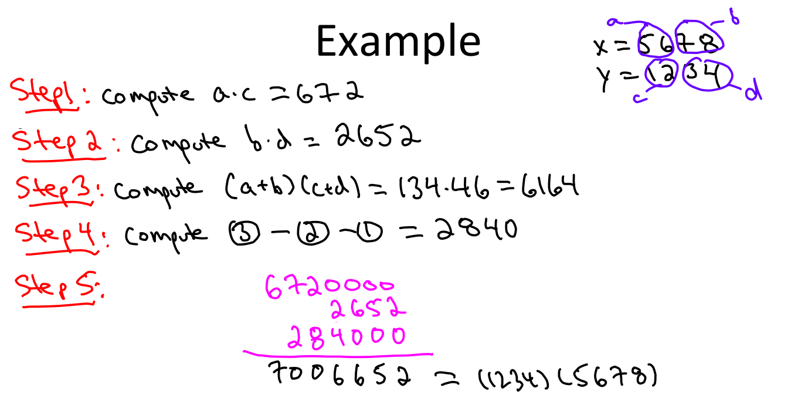
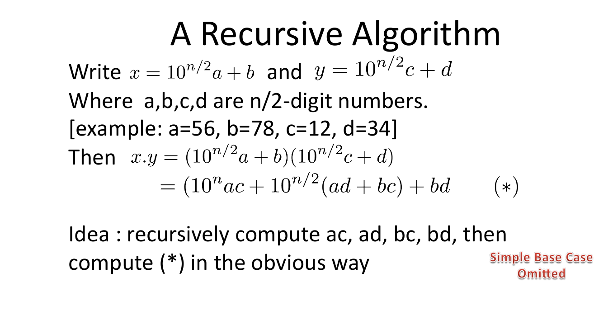

# 大整数乘法

> 参考文献
> * [大数乘法的问题及其高效的算法](https://blog.csdn.net/u010983881/article/details/77503519)

### 问题描述

* 题目描述： 输出两个不超过100位的大整数的乘积。
* 输入： 输入两个大整数，如1234567 和 123
* 输出： 输出乘积，如：151851741
* 数字以字符串的形式给出。
```
求 1234567891011121314151617181920 * 2019181716151413121110987654321 的乘积结果
```

### 问题分析
* 所谓大数相乘（Multiplication algorithm），就是指数字比较大，相乘的结果超出了基本类型的表示范围，所以这样的数不能够直接做乘法运算。参考了很多资料，包括维基百科词条Multiplication algorithm，才知道目前大数乘法算法主要有以下几种思路：

  * 模拟小学乘法：最简单的乘法竖式手算的累加型；
  * 分治乘法：最简单的是Karatsuba乘法，一般化以后有Toom-Cook乘法；
  * 快速傅里叶变换FFT：（为了避免精度问题，可以改用快速数论变换FNTT），时间复杂度O(N lgN lglgN)。具体可参照Schönhage–Strassen algorithm；
  * 中国剩余定理：把每个数分解到一些互素的模上，然后每个同余方程对应乘起来就行；
  * Furer’s algorithm：在渐进意义上FNTT还快的算法。不过好像不太实用，本文就不作介绍了。大家可以参考维基百科Fürer’s algorithm


## 1 大数乘法-模拟小学乘法

### 算法设计
* 模拟乘法手算累加
```
      7 8 9 6 5 2
×         3 2 1 1
-----------------
      7 8 9 6 5 2   <---- 第1趟 
    7 8 9 6 5 2     <---- 第2趟 
   ..........       <---- 第n趟 
-----------------
  ? ? ? ? ? ? ? ?   <---- 最后的值用另一个数组表示 
```
* 如上所示，乘法运算可以分拆为两步：
  1. 首先将数位反置。个位数在低位数组，高位数在高位数组。
  2. 是将乘数与被乘数逐位相乘将逐位相乘得到的结果，对应累计相加起来。r[i+j]+=a[i]*b[j]位置.
  3. 因为每个位置代表1位数。循环一边处理进位。/10的结果加到下一位。%10的结果保留到本位。

> 这个方法，简单易于解。只需要几行代码即可。

### 算法分析

* 时间复杂度O(n^2)
* 空间复杂度O(n)

### 算法实现

```C++
#include<iostream>
#include<vector>
#include<string>
using namespace std;

vector<int> mul_mul(vector<int> a,vector<int> b);
// 以字符串形式给出。还是得把这个形式改成整数数组比较好
int main(){
    string a="123456789";
    string b="987654321";
    // 将字符串转换为整形数组。C的方法可以使用memset分配空间C++直接pushback
    // 将大数数组反向存储。个位存在最开始的位置。方便数组增长。
    vector<int> aa;
    for(int i=a.size()-1;i>=0;i--){
        aa.push_back((int)(a[i]-'0'));
    }
    vector<int> bb;
    for(int i=b.size()-1;i>=0;i--){
        bb.push_back((int)(b[i]-'0'));
    }
    vector<int> result = mul_mul(aa,bb);

    // 将最终的整数数组转换成字符串。并输出
    string res;
    for(int i=result.size()-1;i>=0;i--){
        res+=to_string(result[i]);
    }
    // 去除前边多余的0
    res = res.substr(res.find_first_not_of('0'));
    cout<<res<<endl;
    return 0;
}

// 模拟小学竖式
vector<int> mul_mul(vector<int> a,vector<int> b){
    vector<int> a_b(a.size()+b.size()+1,0);
    // 小学乘法
    for(int i=0;i<a.size();i++){
        for(int j=0;j<b.size();j++){
            a_b[i+j] += a[i]*b[j];
        }
    }
    // 对a_b中的数值进行处理（进位处理）
    for(int i=0;i<a_b.size();i++){
        a_b[i+1]+= a_b[i]/10;
        a_b[i]%=10;
    }
    
    return a_b;
}
```

## 2 大整数乘法-分治法Karatsuba算法

### 问题分析
* 以上两种模拟乘法的手算累加型算法，他们都是模拟普通乘法的计算方式，时间复杂度都是$O(n^2)$，而这个Karatsuba算法，时间复杂度仅有 $O(n^{\log _{2}3})$
* 下面，我就来介绍一下这个算法。Karatsuba于1960年发明在 $O(n^{\log _{2}3})$步骤内将两个n位数相乘的Karatsuba算法。它反证了安德雷·柯尔莫哥洛夫于1956年认为这个乘法需要 $\Omega (n^{2})$ 步骤的猜想。首先来看看这个算法是怎么进行计算的



> `ac*bd`在暴力乘法当中，需要四次乘法运算。`ad,ab,cd,cb`。但是通过分治法。可以使得ad+bc在一次乘法中实现。即`(a+c)*(b+d)-ac-bd=ad+cb`.降低了乘法运算的数量。

### 算法原理



1. 我们假设要相乘的两个数是x * y。我们可以把x，y写成：
$$
x = a * 10^{n/2} + b
\\
y = c * 10^{n/2} + d
$$
2. 这里的n是数字的位数。如果是偶数，则a和b都是n/2位的。如果n是奇数，则你可以让a是n/2+1位，b是n/2位。（例如a = 12，b = 34；a = 123，b = 45），那么x*y就变成了：
$$
x*y = (a * 10^{n/2}+b) * (c * 10^{n/2}+d)
$$
3. 进一步计算，
$$
x*y = a * c * 10^n + (a * d + b * c) * 10^{n/2} + bd
$$

4. 对比之前的计算过程。结果已经呼之欲出了。这里唯一需要注意的两点就是：

> `(a * d + b * c)`的计算为了防止两次乘法，应该使用之前的计算这些乘法在算法里应该是递归实现的，数字很大时，先拆分，然后拆分出来的数字还是很大的话，就继续拆分，直到`a * b`已经是一个非常简单的小问题为之。这也是分治的思想。

### 算法设计

> 该方法比较复杂。

1. 首先根据手推的运算规则。发现在计算过程中需要实现四种计算。分别是：乘法计算、加法计算、减法计算、位移计算（乘以10的指数n。表示在末位添加n个零）
2. 分别实现。三种计算方式。并对高位的零进行处理。但是应该至少保留1位数（这位数如果是零。则表示该数字为零。）
3. 然后实现递归乘法运算。分以下几种情况实现
   1. 递归的接口：两个大数。
   2. 递归的返回值：大数乘积的结果。
   3. 递归的处理：将大数分为两部分。分别实现`a*c,b*d,(a+b)*(c+d)`实现递归。
   4. 递归的终止条件。相乘的两个数只有1位数字。结果如果为零，应该保留1位零。
   5. 递归前的处理：数字对齐。在高位添加零。使得两个数字对齐。
   6. 递归后的处理：将成绩的结果进行加法计算、减法计算、唯一计算。得到最后的结果

4. 难点在于：进行分治前：高位补零进行对齐。返回结果前去除高位多余的零，如果是0，则至少保留1位。

### 算法效率
* 时间复杂度：$O(n^{log_2 3}) = O(n^{1.59})$
* 空间复杂度O(nlog n)

### 算法实现

```C++
#include<iostream>
#include<vector>
#include<string>
using namespace std;

vector<int> mul_mul(vector<int>& a, vector<int>& b);
// 大数加法
vector<int> mul_divided(vector<int> x, vector<int> y);
vector<int> mul_sum(vector<int> a, vector<int>b);
vector<int> mul_minus(vector<int>a, vector<int>b);
vector<int> mul_pow(vector<int>a, int n);
// 以字符串形式给出。还是得把这个形式改成整数数组比较好
int main() {
    string a = "99999999";
    string b = "77777777";
    // 将字符串转换为整形数组。C的方法可以使用memset分配空间C++直接pushback
    // 将大数数组反向存储。个位存在最开始的位置。方便数组增长。
    vector<int> aa;
    for (int i = a.size() - 1; i >= 0; i--) {
        aa.push_back((int)(a[i] - '0'));
    }
    vector<int> bb;
    for (int i = b.size() - 1; i >= 0; i--) {
        bb.push_back((int)(b[i] - '0'));
    }
    //vector<int> result = mul_mul(aa,bb);
    vector<int> result = mul_divided(aa, bb);
    // 将最终的整数数组转换成字符串。并输出
    string res;
    for (int i = result.size() - 1; i >= 0; i--) {
        res += to_string(result[i]);
    }
    // 去除前边多余的0
    // res = res.substr(res.find_first_not_of('0'));
    cout << res << endl;
    return 0;
}

// 模拟小学竖式。反转的字符串。个位在前边。
vector<int> mul_mul(vector<int>& a, vector<int>& b) {
    vector<int> a_b(a.size() + b.size(), 0);
    // 小学乘法，i位置×j位置。在i+j位置保存结果。最后处理进位。
    for (int i = 0; i < a.size(); i++) {
        for (int j = 0; j < b.size(); j++) {
            a_b[i + j] += a[i] * b[j];
        }
    }
    // 对a_b中的数值进行处理（进位处理）
    for (int i = 0; i < a_b.size(); i++) {
        a_b[i + 1] += a_b[i] / 10;
        a_b[i] %= 10;
    }
    //去除高位的0
    int i = a_b.size() - 1;
    while (a_b[i] == 0) {
        a_b.pop_back();
        i--;
    }
    return a_b;
}

// 分治法。
//反转的字符串。个位在前边。
//假设等长只有等长的数据划分才会方便。
// 如果等长情况下的处理
//关于是相乘结果是0的情况应该特殊处理。
vector<int> mul_divided(vector<int> x, vector<int> y) {
    //对x,y短的进行补齐.高位补齐0
    while (x.size() < y.size()) {
        x.push_back(0);
    }
    while (y.size() < x.size()) {
        y.push_back(0);
    }
    // 只在末端做一次乘法
    vector<int> result(x.size() + y.size());
    if (x.size() == 1 && y.size() == 1) {
        result[0] = x[0] * y[0];
        result[1] = result[0] / 10;
        result[0] = result[0] % 10;
        //去除高位的0
        int i = result.size() - 1;
        //但是保留唯一的0；用来表示这是一个0
        while (result.size()>0 && result[i] == 0) {
            result.pop_back();
            i--;
        }
        return result;
    }

    int n = x.size() / 2;
    // 分割成a,b,c,d四个部分
    vector<int> b(x.begin(), x.begin() + n);
    vector<int> a(x.begin() + n, x.end());
    vector<int> d(y.begin(), y.begin() + n);
    vector<int> c(y.begin() + n, y.end());

    // 进行递归
    vector<int> mul1 = mul_divided(a, c);
    vector<int> mul2 = mul_divided(b, d);
    vector<int> mul_ab_cd = mul_divided(mul_sum(a, b), mul_sum(c, d));

    // 加法。个位在前边。
    vector<int> sum_ac_bd = mul_sum(mul1, mul2);
    vector<int> mul3 = mul_minus(mul_ab_cd, sum_ac_bd);


    result = mul_sum(mul_sum(mul_pow(mul1, 2 * n), mul2), mul_pow(mul3, n));
    return result;
}

// 大数加法。
vector<int> mul_sum(vector<int> a, vector<int> b) {
    vector<int> result(max(a.size(), b.size()) + 1, 0);
    for (int i = 0; i < result.size() - 1; i++) {
        if (i < a.size()) {
            result[i] += a[i];
        }
        if (i < b.size()) {
            result[i] += b[i];
        }
        // 处理进位
        result[i + 1] += result[i] / 10;
        result[i] %= 10;
    }
    //去除高位的0
    int i = result.size() - 1;
    while (result.size() > 0 && result[i] == 0) {
        result.pop_back();
        i--;
    }
    return result;
}
// 大数减法（结果不可能是负数）
vector<int> mul_minus(vector<int> a, vector<int>b) {
    vector<int> result(a.size(), 0);
    // 做减法
    for (int i = 0; i < a.size(); i++) {
        if (i < b.size()) {
            result[i] += a[i] - b[i];
        }
        else {
            result[i] += a[i];
        }
        // 处理借位
        if (result[i] < 0) {
            result[i] += 10;
            result[i + 1] -= 1;
        }
    }
    //去除高位的0
    int i = result.size() - 1;
    while (result.size() > 0 && result[i] == 0) {
        result.pop_back();
        i--;
    }
    return result;
}
// 向右移位
vector<int> mul_pow(vector<int> a, int n) {
    vector<int> result(n, 0);
    result.insert(result.end(), a.begin(), a.end());
    //去除高位的0
    int i = result.size() - 1;
    while (result.size() > 0 && result[i] == 0) {
        result.pop_back();
        i--;
    }
    return result;
}
```
