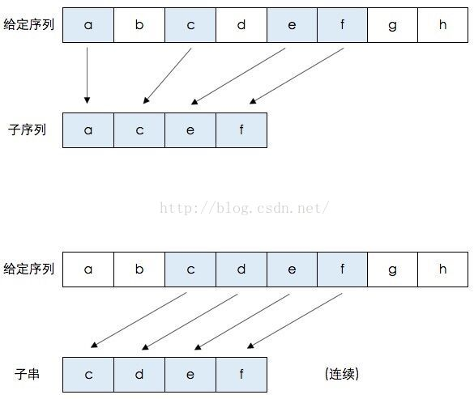

# 动态规划——序列动态规划


> 本质上也是矩阵动态规划，是特殊的矩阵动态规划，出现的频率比较高。包含两个规模增长方向，并且相互独立增长。不懂点在于题目是以序列的形式给出的。而不是矩阵形式给出的。


1. 子序列(subsequence)： 一个特定序列的子序列就是将给定序列中零个或多个元素去掉后得到的结果(不改变元素间相对次序)。例如序列<A,B,C,B,D,A,B>的子序列有：<A,B>、<B,C,A>、<A,B,C,D,A>等。
2. 公共子序列(common subsequence)： 给定序列X和Y，序列Z是X的子序列，也是Y的子序列，则Z是X和Y的公共子序列。例如X=[A,B,C,B,D,A,B]，Y=[B,D,C,A,B,A[，那么序列Z=[B,C,A]为X和Y的公共子序列，其长度为3。但Z不是X和Y的最长公共子序列，而序列[B,C,B,A]和[B,D,A,B]也均为X和Y的最长公共子序列，长度为4，而X和Y不存在长度大于等于5的公共子序列。对于序列[A,B,C]和序列[E,F,G]的公共子序列只有空序列[]。
3. 最长公共子序列：给定序列X和Y，从它们的所有公共子序列中选出长度最长的那一个或几个。
4. 子串： 将一个序列从最前或最后或同时删掉零个或几个字符构成的新系列。区别与子序列，子序列是可以从中间抠掉字符的。cnblogs这个字符串中子序列有多少个呢？很显然有27个，比如其中的cb,cgs等等都是其子序列




## 1 最长上升序列
### 问题描述
给定一个无序的整数数组，找到其中最长上升子序列的长度。

示例:
```
输入: [10,9,2,5,3,7,101,18]输出: 4 解释: 最长的上升子序列是 [2,3,7,101]，它的长度是 4。
```
说明:
可能会有多种最长上升子序列的组合，你只需要输出对应的长度即可。
你算法的时间复杂度应该为 O(n2) 。
进阶: 你能将算法的时间复杂度降低到 O(n log n) 吗?


### 问题分析


### 算法设计

* 问题分解划分阶段：如果我们确定终点位置，然后去 看前面 i – 1 个位置中，哪一个位置可以和当前位置拼接在一起，这样就可以把第 i 个问题拆解成思考之前 i – 1 个问题，注意这里我们并不是不考虑起始位置，在遍历的过程中我们其实已经考虑过了。
* 确定状态变量：dp[i]表示i阶段为终点的最长上升序列
* 确定状态转移方程：
$$
dp[i] = Math.max(dp[j],...,dp[k]) + 1, \\
inputArray[j] < inputArray[i], inputArray[k] < inputArray[i]
$$
* 确定边界。添加初始的0.然后递增。


### 算法分析


### 算法实现

```
int lengthOfLIS(int[] nums) {
    if (nums == null || nums.length == 0) {
        return 0;
    }

    // dp[i] -> the longest length sequence from 0 - i, and must include nums[i]
    int[] dp = new int[nums.length];

    Arrays.fill(dp, 1);

    int max = 0;

    for (int i = 0; i < nums.length; ++i) {
        for (int j = 0; j < i; ++j) {
            if (nums[i] > nums[j]) {
                dp[i] = Math.max(dp[j] + 1, dp[i]);
            }
        }

        max = Math.max(max, dp[i]);
    }

    return max;
}
```

## 2 最长公共子序列
> 5.3

## 3 正则表达式匹配

> 5.13

