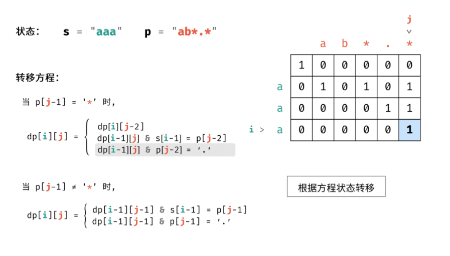

# 正则表达式匹配问题

## 1 正则表达式匹配

### 问题描述

* 请实现一个函数用来匹配包含'\.'和'\*'的正则表达式。模式中的字符'\.'表示任意一个字符，而'\*'表示它前面的字符可以出现任意次（含0次）。在本题中，匹配是指字符串的所有字符匹配整个模式。例如，字符串"aaa"与模式"a.a"和"ab*ac*a"匹配，但与"aa.a"和"ab*a"均不匹配。

### 问题分析

* 可以使用动态规划。将字符串的规模增长的方向和pattern规模增长的方向，作为动态变化的方向。状态变量表示当前的正则表达式，能够与之匹配。当规模发生变化时，保证字符串-1和正则表达式-1能够匹配。其实在这里感觉规模增长的方向，确实是有两个。但是状态变量的设置比较精巧。
* 这与最长公共子序列，完全是同一类问题。都是两个方向的动态规划规模增长。包括str和pattern两个方向。

### 问题分类

* 字符串匹配问题
* 动态规划
* 递归

### 选择策略
* 动态规划

### 算法设计

* 设s的长度为n ，p 的长度为 m ；将 s 的第 i 个字符记为$s_i$，p 的第 j个字符记为 $p_j$ ，将 s 的前 i 个字符组成的子字符串记为s[:i] , 同理将 p 的前 j 个字符组成的子字符串记为 p[:j]p[:j] 。

* 因此，本题可转化为求s[:n] 是否能和p[:m] 匹配。

* 总体思路是从 s[:1]和 p[:1]是否能匹配开始判断，每轮添加一个字符并判断是否能匹配，直至添加完整个字符串s 和p 。展开来看，假设 s[:i]与 p[:j]可以匹配，那么下一状态有两种：
  1. 添加一个字符 $s_{i+1}$后是否能匹配？
  2. 添加字符 $p_{j+1}$后是否能匹配？

* 本题的状态共有 m \times nm×n 种，应定义状态矩阵dp ，dp[i][j]代表 s[:i]与 p[:j]是否可以匹配。做好状态定义，接下来就是根据 「普通字符」 , 「.」 , 「*」三种字符的功能定义，分析出动态规划的转移方程。

1. **状态定义**： 设动态规划矩阵 dp ， dp[i][j] 代表字符串 s 的前 i 个字符和 p 的前 j 个字符能否匹配。
2. **转移方程**： 需要注意，由于 dp[0][0] 代表的是空字符的状态， 因此 dp[i][j] 对应的添加字符是 s[i - 1] 和 p[j - 1] 。
   * 当 p[j - 1] = '*' 时， dp[i][j] 在当以下任一情况为 truetrue 时等于 truetrue ：
     1. dp[i][j - 2]： 即将字符组合 p[j - 2] * 看作出现 0 次时，能否匹配.
     2. dp[i - 1][j] 且 s[i - 1] = p[j - 2]: 即让字符 p[j - 2] 多出现 1 次时，能否匹配；
     3. dp[i - 1][j] 且 p[j - 2] = '.': 即让字符 '.' 多出现 1 次时，能否匹配；
  * 当 p[j - 1] != '*' 时， dp[i][j] 在当以下任一情况为 truetrue 时等于 truetrue ：
     1. dp[i - 1][j - 1] 且 s[i - 1] = p[j - 1]： 即让字符 p[j - 1] 多出现一次时，能否匹配；
     2. dp[i - 1][j - 1] 且 p[j - 1] = '.'： 即将字符 . 看作字符 s[i - 1] 时，能否匹配；
* **初始化**： 需要先初始化 dp 矩阵首行，以避免状态转移时索引越界。
* **返回值** dp 矩阵右下角字符，代表字符串 s 和 p 能否匹配。


### 算法分析

* 时间复杂度O(M*N)
* 空间复杂度O(M*N)

### 算法实现

```C++
class Solution {
public:
    bool isMatch(string s, string p) {
        int m = s.size() + 1, n = p.size() + 1;
        vector<vector<bool>> dp(m, vector<bool>(n, false));
        dp[0][0] = true;
        for(int j = 2; j < n; j += 2)
            dp[0][j] = dp[0][j - 2] && p[j - 1] == '*';
        for(int i = 1; i < m; i++) {
            for(int j = 1; j < n; j++) {
                dp[i][j] = p[j - 1] == '*' ?
                    dp[i][j - 2] || dp[i - 1][j] && (s[i - 1] == p[j - 2] || p[j - 2] == '.'):
                    dp[i - 1][j - 1] && (p[j - 1] == '.' || s[i - 1] == p[j - 1]);
            }
        }
        return dp[m - 1][n - 1];
    }
};
```


## 递归法


### 代码实现
```
class Solution {
public:
    bool isMatch(string s, string p) {
        return isMatchR(s,p,0,0);
    }
    // 递归和循环混搭，果然很恶心。直接使用递归好了。
    bool isMatchR(string &s,string &p,int i,int j){
        //递归终止的条件
        if(i>=s.size() && j>=p.size()){
            return true;
        }
        // cout<<i<<j<<endl;
        // *判断。
        if(j+1<p.size() && p[j+1]=='*'){
            // 匹配零次 || 匹配一次
            return isMatchR(s,p,i,j+2) || ((i<s.size()) && (p[j]==s[i]||p[j]=='.')&&isMatchR(s,p,i+1,j));

        }
        // 如果下一个不是*
        if(i<s.size() && j<p.size() && p[j]==s[i]){
            return isMatchR(s,p,i+1,j+1);
        }
        if(i<s.size() && j<p.size() && p[j]=='.'){
            return isMatchR(s,p,i+1,j+1);
        }
        // 不匹配
        return false;
        
        
    }
};
```