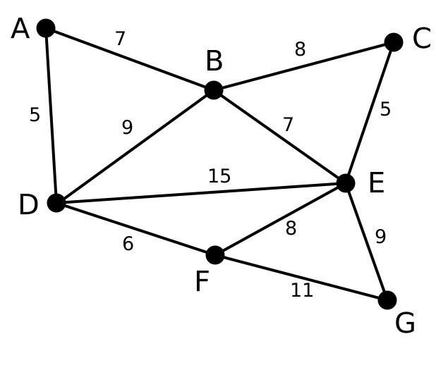
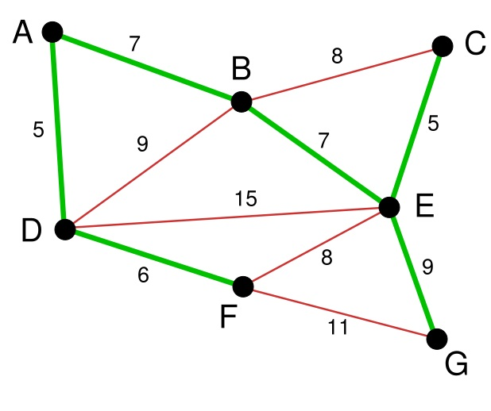

# 图算法-Dijkstra算法

> 目录
>* 图算法-Dijkstra算法
>* 图算法-Floyd算法
>* 图算法-Bellman-Ford算法
>* 图算法-Prim算法
>* 图算法-Kruskal算法

> 参考文献
> [https://www.cnblogs.com/ggzhangxiaochao/p/9070873.html](https://www.cnblogs.com/ggzhangxiaochao/p/9070873.html)
## 1 问题描述
* Kruskal算法是一种用来寻找**最小生成树的算法**，由Joseph Kruskal在1956年发表。用来解决同样问题的还有Prim算法和Boruvka算法等。三种算法都是贪婪算法的应用。和Boruvka算法不同的地方是，Kruskal算法在图中存在相同权值的边时也有效。

## 2 算法原理

1. 记Graph中有v个顶点，e个边

2. 新建图Graphnew，Graphnew中拥有原图中相同的e个顶点，但没有边

3. 将原图Graph中所有e个边按权值从小到大排序

4. 循环：从权值最小的边开始遍历每条边。if这条边连接的两个节点于图Graphnew中不在同一个连通分量中，添加这条边到图Graphnew中。直至图Graph中所有的节点都在同一个连通分量中。


## 3 算法流程

1. 首先第一步，我们有一张图Graph，有若干点和边


2. 将所有的边的长度排序，用排序的结果作为我们选择边的依据。这里再次体现了贪心算法的思想。资源排序，对局部最优的资源进行选择，排序完成后，我们率先选择了边AD。


3. 在剩下的变中寻找。我们找到了CE。这里边的权重也是5


4. 依次类推我们找到了6,7,7，即DF，AB，BE。


5. 下面继续选择， BC或者EF尽管现在长度为8的边是最小的未选择的边。但是现在他们已经连通了（对于BC可以通过CE,EB来连接，类似的EF可以通过EB,BA,AD,DF来接连）。所以不需要选择他们。类似的BD也已经连通了（这里上图的连通线用红色表示了）。最后就剩下EG和FG了。当然我们选择了EG。



## 4 算法效率

时间复杂度：$O(E*\log_2V)$

## 5 算法实现

```C++
typedef struct          
{        
    char vertex[VertexNum];                                //顶点表         
    int edges[VertexNum][VertexNum];                       //邻接矩阵,可看做边表         
    int n,e;                                               //图中当前的顶点数和边数         
}MGraph; 
 
typedef struct node  
{  
    int u;                                                 //边的起始顶点   
    int v;                                                 //边的终止顶点   
    int w;                                                 //边的权值   
}Edge; 

void kruskal(MGraph G)  
{  
    int i,j,u1,v1,sn1,sn2,k;  
    int vset[VertexNum];                                    //辅助数组，判定两个顶点是否连通   
    int E[EdgeNum];                                         //存放所有的边   
    k=0;                                                    //E数组的下标从0开始   
    for (i=0;i<G.n;i++)  
    {  
        for (j=0;j<G.n;j++)  
        {  
            if (G.edges[i][j]!=0 && G.edges[i][j]!=INF)  
            {  
                E[k].u=i;  
                E[k].v=j;  
                E[k].w=G.edges[i][j];  
                k++;  
            }  
        }  
    }     
    heapsort(E,k,sizeof(E[0]));                            //堆排序，按权值从小到大排列       
    for (i=0;i<G.n;i++)                                    //初始化辅助数组   
    {  
        vset[i]=i;  
    }  
    k=1;                                                   //生成的边数，最后要刚好为总边数   
    j=0;                                                   //E中的下标   
    while (k<G.n)  
    {   
        sn1=vset[E[j].u];  
        sn2=vset[E[j].v];                                  //得到两顶点属于的集合编号   
        if (sn1!=sn2)                                      //不在同一集合编号内的话，把边加入最小生成树   
        {
            printf("%d ---> %d, %d",E[j].u,E[j].v,E[j].w);       
            k++;  
            for (i=0;i<G.n;i++)  
            {  
                if (vset[i]==sn2)  
                {  
                    vset[i]=sn1;  
                }  
            }             
        }  
        j++;  
    }  
}  
```
