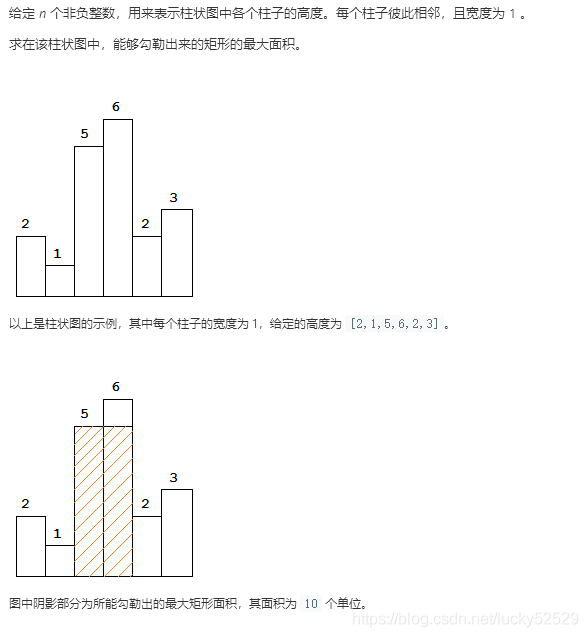

# 单调栈

* 用来解决**局部顺序问题**
* 柱形图问题多使用单调栈。

> 下边是对柱形图问题的总结。
> * [视野总和](#1-视野总和)：利用了栈内元素的数量计算问题。
> * [柱形图中的最大矩形](#2-柱状图中的最大矩形)：利用的是**出栈序列**。这组序列构成了可能的最大矩形。
> * [盛最多水的容器](4.3%20数组与滑动窗口.md)：利用了反向贪心思想。
> * [接雨水问题](3.3%20接雨水问题.md)：单调栈解法也是利用了**出栈序列**。这个序列的左右边界能够形成一个容器。双指针解法利用了反向贪心思想。
> * [接雨水问题2](3.3%20接雨水问题.md)
> 
> 其它类型的单调栈
> * [求最大区间](#3-求最大区间)：利用的**出栈的序列**。表示一个可能的最大值区间。
> * [132模式](#4-132-模式)：利用了其有序性。


## 1 视野总和

### 问题描述

* 有n个人站队，所有的人全部向右看，个子高的可以看到个子低的发型，给出每个人的身高，问所有人能看到其他人发现总和是多少。
```
输入：4 3 7 1
输出：2
解释：个子为4的可以看到个子为3的发型，个子为7可以看到个子为1的身高，所以1+1=2
```
### 问题分析

* 问题分类:
* 思路：观察题之后，我们发现实际上题目转化为找当前数字向右查找的第一个大于他的数字之间有多少个数字，然后将每个结果累计就是答案，但是这里时间复杂度为O(N^2)，所以我们使用单调栈来解决这个问题。

### 策略选择
* 数据结构：单调栈
* 算法思想：局部降序统计

### 算法设计

1. 设置一个单调递减栈
2. 当入栈的的时候，栈内的人肯定能看到该元素。


> 利用了栈内元素的数量，解决问题。

### 算法分析

* 时间复杂度为O(N)
* 空间复杂度O(N)


### 算法实现

```C++
int FieldSum(vector<int>& v)
{
	stack<int> s;
	int sum = 0;
	for (int i = 0; i < (int)v.size(); i++)
	{
        //除去违反规则的人
        while (!st.empty() && v[st.top()] <= v[i])s.pop();
        // 增加能看到该元素的人
        sum+=s.size();
        st.push(i);
	}
	return sum;
}
```


## 2 柱状图中的最大矩形

### 问题描述



### 问题分析


### 策略选择

* 思路：当前的数字可以向两边拓展，遇到比自己大的就接着拓展，小的就停止，然后用自己的高度乘以拓展的宽度，每次更新最大面积，时间复杂度同样为O(N^2)，所以我们接着借助单调栈

### 算法设计

1. 设置一个单调递增栈
2. 当遇到小于栈顶元素的值，我们开始更新数据，因为有可能最大面积就会出现在栈中的序列里
3. 牢记栈中数据永远是有序的，这个问题比较复杂，所以读者不妨对照着代码来理解问题
### 算法分析

* 时间复杂度为O(N)
* 空间复杂度O(N)

### 算法实现

```C++
int largestRectangleArea(vector<int>& heights) {
	heights.push_back(-1);/同理，我们希望栈中所有数据出栈，所以给数组最后添加一个负数
	stack<int> st;
	int ret = 0, top;
	for (int i = 0; i < heights.size(); i++)
	{
		if (st.empty() || heights[st.top()] <= heights[i])
		{
			st.push(i);
		}
		else
		{
			while (!st.empty() && heights[st.top()] > heights[i])
			{
				top = st.top();
				st.pop();
				//i-top指的是当前矩形的宽度，heights[top]就是当前的高度
				//再次强调栈中现在为单调递增
				int tmp = (i - top)*heights[top];
				if (tmp > ret)
					ret = tmp;
			}
			// 把最后出栈的元素入栈，将其高度改成当前的高度。
			// 表示当前元素之前，从top-i都比现在元素要高。
			// 这方法太秀了，只能背下来吧。
			st.push(top);
			heights[top] = heights[i];
		}
	}
	return ret;
}
```
## 3 求最大区间

### 问题描述

* 描述：给出一组数字，求一区间，使得区间元素和乘以区间最小值最大，结果要求给出这个最大值和区间的左右端点
```
输入：3 1 6 4 5 2
输出：60
       3 5
```
* 解释：将3到5（6+4+5）这段区间相加，将和与区间内最小元素相乘获得最大数字60

### 问题分析

### 策略选择

* 思路：使用暴力解法求出所有区间，再求出区间的最小值相乘跟新数据，并不是一种很好的算法，所以经过上面俩题的磨         炼，此时我们应该使用一个单调递减栈

### 算法设计

1. 设置一个单调递增栈
2. 当遇到小于栈顶元素的值，我们开始更新数据，因为当前遇到的值一定是当前序列最小的


### 算法分析

* 时间复杂度O(n)
* 空间复杂度O(n)
### 算法实现

```C++
int GetMaxSequence(vector<int>& v)
{
	stack<int> st;
	vector<int> vs(v.size()+1);
	vs[0] = 0;
	for (int i = 1; i < vs.size(); i++)
	{
			vs[i] = vs[i - 1] + v[i-1];
	}
	v.push_back(-1);
	int top, start, end, ret = 0;
	for (int i = 0; i < v.size(); i++)
	{
		if (st.empty() || v[st.top()] <= v[i])
		{
			st.push(i);
		}
		else
		{
			while (!st.empty() && v[st.top()] > v[i])
			{
				top = st.top();
				st.pop();
				int tmp = vs[i] - vs[top];
				tmp = tmp * v[top];
				if (tmp > ret)
				{
					ret = tmp;
					start = top+1;
					end = i;
				}
			}
			st.push(top);
			v[top] = v[i];//与第二题相同的道理，将当前数据的更改最左的top下标，防止出现比当前数据更小的数据
			//这句在这道题里真的超级难理解，但是只要你有耐心相信你可以理解的
		}
	}
	return ret
}
```
## 4 132 模式

### 问题描述

* 给你一个整数数组 nums ，数组中共有 n 个整数。132 模式的子序列 由三个整数 nums[i]、nums[j] 和 nums[k] 组成，并同时满足：i < j < k 和 nums[i] < nums[k] < nums[j] 。

* 如果 nums 中存在 132 模式的子序列 ，返回 true ；否则，返回 false 。

* 进阶：很容易想到时间复杂度为 O(n^2) 的解决方案，你可以设计一个时间复杂度为 O(n logn) 或 O(n) 的解决方案吗？

 

* 示例 1：
```
输入：nums = [1,2,3,4]
输出：false
解释：序列中不存在 132 模式的子序列。
```
* 示例 2：
```
输入：nums = [3,1,4,2]
输出：true
解释：序列中有 1 个 132 模式的子序列： [1, 4, 2] 。
```
### 问题分析

### 策略选择


### 算法设计

* 因此，我们可以使用单调栈作为维护 22 的数据结构，并给出下面的算法：

* 我们用单调栈维护所有可以作为 22 的候选元素。初始时，单调栈中只有唯一的元素 \textit{a}[n-1]a[n−1]。我们还需要使用一个变量 \textit{max\_k}max_k 记录所有可以真正作为 22 的元素的最大值；

* 随后我们从 n-2n−2 开始从右到左枚举元素 a[i]a[i]：

  * 首先我们判断 a[i]a[i] 是否可以作为 11。如果 a[i] < \textit{max\_k}a[i]<max_k，那么它就可以作为 11，我们就找到了一组满足 132132 模式的三元组；

  * 随后我们判断 a[i]a[i] 是否可以作为 33，以此找出哪些可以真正作为 22 的元素。我们将 a[i]a[i] 不断地与单调栈栈顶的元素进行比较，如果 a[i]a[i] 较大，那么栈顶元素可以真正作为 22，将其弹出并更新 \textit{max\_k}max_k；

  * 最后我们将 a[i]a[i] 作为 22 的候选元素放入单调栈中。这里可以进行一个优化，即如果 a[i] \leq \textit{max\_k}a[i]≤max_k，那么我们也没有必要将 a[i]a[i] 放入栈中，因为即使它在未来被弹出，也不会将 \textit{max\_k}max_k 更新为更大的值。

* 在枚举完所有的元素后，如果仍未找到满足 132132 模式的三元组，那就说明其不存在。


### 算法分析

* 时间复杂度：O(n)。
* 空间复杂度：O(n)


### 算法实现

```
class Solution {
public:
    bool find132pattern(vector<int>& nums) {
        stack<int> s;
        int mask2=INT_MIN;
        // 找比它大的第一个数。单调递减栈。大的pop出去
        for(int i=nums.size()-1;i>=0;i--){
            if(nums[i]<mask2)return true;
            while(!s.empty() && nums[i]>s.top()){
                if(mask2<s.top())mask2=s.top();
                s.pop();
            }
            s.push(nums[i]);
        }
        return false;
    }
};
```


## 5 包含min函数的栈

### 问题描述
* 定义栈的数据结构，请在该类型中实现一个能够得到栈的最小元素的 min 函数在该栈中，调用 min、push 及 pop 的时间复杂度都是 O(1)。

 

示例:
```
MinStack minStack = new MinStack();
minStack.push(-2);
minStack.push(0);
minStack.push(-3);
minStack.min();   --> 返回 -3.
minStack.pop();
minStack.top();      --> 返回 0.
minStack.min();   --> 返回 -2.
```

> 提示：各函数的调用总次数不超过 20000 次

### 问题分析


### 策略选择


### 算法设计
* 将 min() 函数复杂度降为 O(1)O(1) ，可通过建立辅助栈实现；
  * 数据栈 AA ： 栈 AA 用于存储所有元素，保证入栈 push() 函数、出栈 pop() 函数、获取栈顶 top() 函数的正常逻辑。
  * 辅助栈 BB ： 栈 BB 中存储栈 AA 中所有 非严格降序 的元素，则栈 AA 中的最小元素始终对应栈 BB 的栈顶元素，即 min() 函数只需返回栈 BB 的栈顶元素即可。
* 因此，只需设法维护好 栈 BB 的元素，使其保持非严格降序，即可实现 min() 函数的 O(1)O(1) 复杂度。
 


### 算法分析

### 算法实现

```C++
class MinStack {
public:
    /** initialize your data structure here. */
    stack <int> s;
    stack <int> m;
    MinStack() {

    }
    
    void push(int x) {
        s.push(x);
        if(m.empty() || x <= m.top()) m.push(x);
    }
    
    void pop() {
        if(s.top() == m.top())  m.pop();
        s.pop();
    }
    
    int top() {
        return s.top();
    }
    
    int min() {
        return m.top();
    }
};
```

