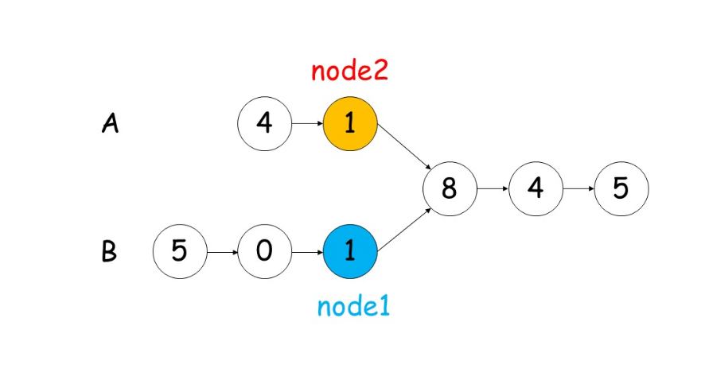

# 链表与双指针


## 1 链表中的倒数第k个节点

### 问题描述

* 输入一个链表，输出该链表中倒数第k个节点。为了符合大多数人的习惯，本题从1开始计数，即链表的尾节点是倒数第1个节点。例如，一个链表有 6 个节点，从头节点开始，它们的值依次是 1、2、3、4、5、6。这个链表的倒数第 3 个节点是值为 4 的节点。

### 问题分析

* 典型的双指针问题

### 问题分类

* 数组与链表
* 双指针问题

### 策略选择

* 蛮力法

### 算法流程

* 两个一样快的指针。相距k个距离。
* 一个到达终点，另一个则为倒数第k个节点

### 算法分析
* 时间复杂度O(n)
* 空间复杂度O(1)

### 算法实现

```C++
    ListNode* getKthFromEnd(ListNode* head, int k) {
        ListNode* first=head;
        ListNode* second=head;
        while(--k){
            second=second->next;
        }
        while(second->next){
            second = second->next;
            first = first->next;
        }
        return first;
    }
```

## 2 两个链表的第一个公共节点

### 问题描述

输入两个链表，找出它们的第一个公共节点。这两个链表不相交，返回 null。


要求：
* 如果两个链表没有交点，返回 null.
* 在返回结果后，两个链表仍须保持原有的结构。
* 可假定整个链表结构中没有循环。
* 程序尽量满足 O(n) 时间复杂度，且仅用 O(1) 内存。
[链接](https://leetcode-cn.com/problems/liang-ge-lian-biao-de-di-yi-ge-gong-gong-jie-dian-lcof)
### 问题分析

* 问题类别：双指针
  
### 策略选择

* 数据结构：线性数据结构
* 算法思想：双指针

### 算法设计
* 我们使用两个指针 node1，node2 分别指向两个链表 headA，headB 的头结点，然后同时分别逐结点遍历，
* 当 node1 到达链表 headA 的末尾时，重新定位到链表 headB 的头结点；
* 当 node2 到达链表 headB 的末尾时，重新定位到链表 headA 的头结点。



### 算法分析

- 时间复杂度：O(M+N)O(M+N)。
- 空间复杂度：O(1)O(1)。

### 算法实现

```C++
class Solution {
public:
    ListNode *getIntersectionNode(ListNode *headA, ListNode *headB) {
        ListNode *node1 = headA;
        ListNode *node2 = headB;
        
        while (node1 != node2) {
            node1 = node1 != NULL ? node1->next : headB;
            node2 = node2 != NULL ? node2->next : headA;
        }
        return node1;
    }
};
```

## 3 和为s的两个数字
### 问题描述

* 输入一个递增排序的数组和一个数字s，在数组中查找两个数，使得它们的和正好是s。如果有多对数字的和等于s，则输出任意一对即可。
* 示例 1：
```
输入：nums = [2,7,11,15], target = 9
输出：[2,7] 或者 [7,2]
```
### 问题分析


### 策略选择

* 数据结构：线型数组
* 算法思想：双指针搜搜
### 算法设计
始化： 双指针 ii , jj 分别指向数组 numsnums 的左右两端 （俗称对撞双指针）。
循环搜索： 当双指针相遇时跳出；
计算和 s = nums[i] + nums[j]s=nums[i]+nums[j] ；
若 s > targets>target ，则指针 jj 向左移动，即执行 j = j - 1j=j−1 ；
若 s < targets<target ，则指针 ii 向右移动，即执行 i = i + 1i=i+1 ；
若 s = targets=target ，立即返回数组 [nums[i], nums[j]][nums[i],nums[j]] ；
返回空数组，代表无和为 targettarget 的数字组合。


### 算法分析
* 时间复杂度 O(N)： N为数组 nums 的长度；双指针共同线性遍历整个数组。
* 空间复杂度 O(1) ： 变量 i, j 使用常数大小的额外空间。

### 算法实现

```C++
    vector<int> twoSum(vector<int>& nums, int target) {
        vector<int> vec;
        int i=0,j=nums.size()-1;
        while(nums[i]+nums[j]!=target){
            if(nums[i]+nums[j]>target)j--;
            if(nums[i]+nums[j]<target)i++;
        }
        vec.push_back(nums[i]);
        vec.push_back(nums[j]);
        return vec;
    }
```