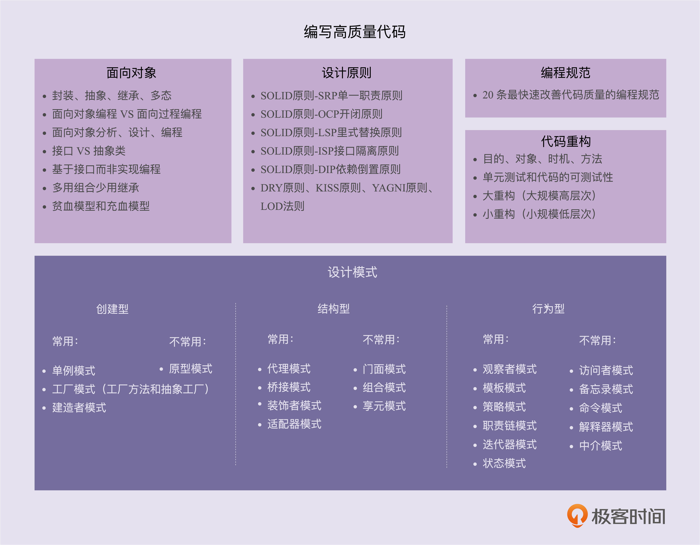
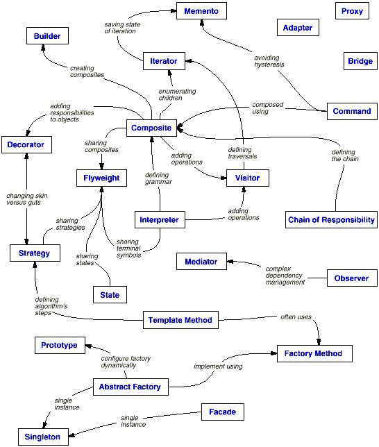

# 设计模式之美

> 参考文献
> * [https://www.cnblogs.com/gaochundong/tag/Design%20Pattern/](https://www.cnblogs.com/gaochundong/tag/Design%20Pattern/)

> 目录
> 1. 设计模式分类
> 2. 设计模式之间的关系
> 3. 设计模式所支持的设计的可变方面
> 4. 设计模式怎样解决设计问题

## 1 设计模式分类

<table border="1">
    <tbody>
        <tr>
            <td scope="col" rowspan="2" colspan="2" align="left" valign="middle">
                
&nbsp;

            </td>
            <td align="left" valign="middle" colspan="3"><strong>目的 (Purpose)</strong></td>
        </tr>
        <tr>
            <td>
                
<a><strong>创建型 (Creational)</strong></a>

            </td>
            <td>
                
<a><strong>结构型
                                (Structural)</strong></a> 

            </td>
            <td>
                
<a><strong>行为型 (Behavioral)</strong></a>

            </td>
        </tr>
        <tr>
            <td scope="col" rowspan="2" align="left" valign="middle">
                
<strong>范围</strong>

                
<strong>(Scope)</strong>

            </td>
            <td>
                
<strong>类</strong>

                
<strong>(Class)</strong>

            </td>
            <td>
                
<a>Factory Method</a>

            </td>
            <td><a>Adapter</a></td>
            <td>
                
<a>Interpreter</a>

                
<a>Template Method</a>

            </td>
        </tr>
        <tr>
            <td>
                
<strong>对象</strong>

                
<strong>(Object)</strong>

            </td>
            <td>
                
<a>Abstract Factory</a>

                
<a>Builder</a>

                
<a>Prototype</a>

                
<a>Singleton</a>

            </td>
            <td>
                
<a>Adapter</a>

                
<a>Bridge</a>

                
<a>Composite</a>

                
<a>Decorator</a>

                
<a>Facade</a>

                
<a>Flyweight</a>

                
<a>Proxy</a>

            </td>
            <td>
                
<a>Chain of Responsibility</a>

                
<a>Command</a>

                
<a>Iterator</a>

                
<a>Mediator</a>

                
<a>Memento</a>

                
<a>Observer</a>

                
<a>State</a>

                
<a>Strategy</a>

                
<a>Visitor</a>

            </td>
        </tr>
    </tbody>
</table>
 
### 模式的目的 (Purpose)，即模式是用来完成什么工作的：

* 创建型 (Creational) 模式与对象的创建有关；
* 结构型 (Structural) 模式处理类或对象的组合；
* 行为型 (Behavioral) 模式对类或对象怎样交互和怎样分配职责进行描述；

### 模式的范围 (Scope)，即模式主要用于类还是用于对象。

* 类模式 (Class)，处理类和子类之间的关系，这些关系通过继承建立，在编译时即确定，具有静态性；
* 对象模式 (Object)，处理对象间的关系，这些关系在运行时是可变化的，具有动态性；

### 模式的说明
1. 创建型类模式将对象的部分创建工作延迟到子类；
2. 创建型对象模式将对象的部分创建工作延迟到另一个对象中；
3. 结构型类模式使用继承机制类组合类；
4. 结构型对象模式描述了对象的组装方式；
5. 行为型类模式使用继承描述算法和控制流；
6. 行为型对象模式描述一组对象怎样写作完成单个对象无法完成的任务；

## 2 设计模式之间的关系
 

## 3 设计模式所支持的设计的可变方面
<table border="1">
    <tbody>
        <tr>
            <td valign="middle">
                
<strong>目的 </strong>

                
<strong>(Purpose)</strong>

            </td>
            <td valign="middle">
                
<strong>设计模式 </strong>

                
<strong>(Design Pattern)</strong>

            </td>
            <td>
                
<strong>意图</strong>

                
<strong>(Intent)</strong>

            </td>
            <td>
                
<strong>可变的方面 </strong>

                
<strong>(Aspect(s) That Can Vary)</strong>

            </td>
        </tr>
        <tr>
            <td scope="col" rowspan="5" align="left" valign="middle">
                
<strong>创建型 </strong>

                
<strong>(Creational)</strong>

            </td>
            <td>
                
<a>Abstract
                            Factory</a>

            </td>
            <td>Factory for building related objects</td>
            <td>
                
families of product objects&nbsp;

            </td>
        </tr>
        <tr>
            <td>
                
<a>Builder</a>
                

            </td>
            <td>
                
Factory for building complex objects incrementally

            </td>
            <td>
                
how a composite object gets created

            </td>
        </tr>
        <tr>
            <td>
                
<a>Factory
                            Method</a>

            </td>
            <td>
                
Method in a derived class creates
                        associates&nbsp;

            </td>
            <td>
                
subclass of object that is instantiated

            </td>
        </tr>
        <tr>
            <td>
                
<a>Prototype</a>
                

            </td>
            <td>
                
Factory for cloning new instances from a
                        prototype&nbsp;

            </td>
            <td>
                
class of object that is instantiated

            </td>
        </tr>
        <tr>
            <td>
                
<a>Singleton</a>
                

            </td>
            <td>
                
Factory for a singular (sole) instance

            </td>
            <td>
                
the sole instance of a class

            </td>
        </tr>
        <tr>
            <td scope="col" rowspan="7" align="left" valign="middle">
                
<strong>结构型 </strong>

                
<strong>(Structural)</strong>

            </td>
            <td>
                
<a>Adapter</a>
                

            </td>
            <td>
                
Translator adapts a server interface for a
                        client

            </td>
            <td>
                
interface to an object

            </td>
        </tr>
        <tr>
            <td>
                
<a>Bridge</a>

            </td>
            <td>
                
Abstraction for binding one of many
                        implementations

            </td>
            <td>
                
implementation of an object

            </td>
        </tr>
        <tr>
            <td>
                
<a>Composite</a>
                

            </td>
            <td>
                
Structure for buiding recursive aggregations
                

            </td>
            <td>
                
structure and composition of an object

            </td>
        </tr>
        <tr>
            <td>
                
<a>Decorator</a>
                

            </td>
            <td>
                
Decorator extends an object
                        transparently&nbsp;

            </td>
            <td>
                
responsibilities of an object without subclassing

            </td>
        </tr>
        <tr>
            <td>
                
<a>Facade</a>

            </td>
            <td>
                
Facade simplifies the interface for a
                        subsystem

            </td>
            <td>
                
interface to a subsystem

            </td>
        </tr>
        <tr>
            <td>
                
<a>Flyweight</a>
                

            </td>
            <td>
                
Many fine-grained objects shared
                        efficently&nbsp;

            </td>
            <td>
                
storage costs of objects

            </td>
        </tr>
        <tr>
            <td>
                
<a>Proxy</a>

            </td>
            <td>
                
One object approximates another&nbsp;

            </td>
            <td>
                
how an object is accessed; its location

            </td>
        </tr>
        <tr>
            <td scope="col" rowspan="11" align="left" valign="middle">
                
<strong>行为型 </strong>

                
<strong>(Behavioral)</strong>

            </td>
            <td>
                
<a>Chain
                            of Responsibility</a>

            </td>
            <td>
                
Request delegated to the responsible service
                        provider

            </td>
            <td>
                
object that can fulfill a request

            </td>
        </tr>
        <tr>
            <td>
                
<a>Command</a>
                

            </td>
            <td>
                
Request as first-class object

            </td>
            <td>
                
when and how a request is fulfilled

            </td>
        </tr>
        <tr>
            <td>
                
<a>Interpreter</a>
                

            </td>
            <td>
                
Language interpreter for a small grammar

            </td>
            <td>
                
grammar and interpretation of a language

            </td>
        </tr>
        <tr>
            <td>
                
<a>Iterator</a>
                

            </td>
            <td>Aggregate elements are accessed sequentially&nbsp;</td>
            <td>
                
how an aggregate's elements are accessed, traversed

            </td>
        </tr>
        <tr>
            <td>
                
<a>Mediator</a>
                

            </td>
            <td>
                
Mediator coordinates interactions between its
                        associates

            </td>
            <td>
                
how and which objects interact with each other

            </td>
        </tr>
        <tr>
            <td>
                
<a>Memento</a>
                

            </td>
            <td>
                
Snapshot captures and restores object states
                        privately&nbsp;

            </td>
            <td>
                
what private information is stored outside and object, and when
                

            </td>
        </tr>
        <tr>
            <td>
                
<a>Observer</a>
                

            </td>
            <td>
                
Dependents update automatically when a subject
                        changes&nbsp;

            </td>
            <td>
                
number of objects that depend on another object; 

                
how the dependent objects stay up to date

            </td>
        </tr>
        <tr>
            <td>
                
<a>State</a>

            </td>
            <td>
                
Object whose behavior depends on its
                        state&nbsp;

            </td>
            <td>
                
states of and object

            </td>
        </tr>
        <tr>
            <td>
                
<a>Strategy</a>
                

            </td>
            <td>
                
Abstraction for selecting one of many
                        algorithms

            </td>
            <td>
                
an algorithm

            </td>
        </tr>
        <tr>
            <td>
                
<a>Template
                            Method</a>

            </td>
            <td>
                
Algorithm with some steps supplied by a derived
                        class&nbsp;

            </td>
            <td>
                
steps of an algorithm

            </td>
        </tr>
        <tr>
            <td>
                
<a>Visitor</a>
                

            </td>
            <td>
                
Operations applied to elements of an heterogeneous
                        object structure&nbsp;

            </td>
            <td>
                
operations that can be applied to object(s) without changing their
                        class(es)

            </td>
        </tr>
    </tbody>
</table>

## 4 设计模式怎样解决设计问题
1. 寻找合适的对象
   * 面向对象程序由对象组成，对象包括数据和对数据进行操作的过程，过程通常称为方法或操作。
   * 对象在收到客户的请求（或消息）后，执行相应的操作。
   * 客户请求是使对象执行操作的唯一方法，操作又是对象改变内部数据的唯一方法。
   * 由于这些限制，对象的内部状态是被封装的，它不能被直接访问，它的表示对于对象外部是不可见的。
   * 面向对象设计最困难的部分是将系统分解成对象集合。
   * 因为要考虑许多因素：封装、粒度、依赖关系、灵活性、性能、演化、复用等，它们都影响着系统的分解，并且这些因素通常还是互相冲突的。
   * 设计的许多对象来源于现实世界的分析模型。但是，设计结果所得到的类通常在现实世界中并不存在，有些是像数组之类的低层类，而另一些则层次较高。
   * 设计模式帮你确定并不明显的抽象和描述这些抽象的对象。例如，描述过程或算法的对象现实中并不存在，但它们却是设计的关键部分。
2. 决定对象的粒度
   * 对象在大小和数目上的变化极大。它们能表示下自硬件或上自整个应用的任何事物。
   * 那么我们怎么决定一个对象应该是什么呢？设计模式很好地讲述了这个问题。
   * Facade 模式描述了怎样用对象表示完整的子系统。
   * Flyweight 模式描述了如何支持大量的最小粒度的对象。
   * 其他一些设计模式描述了将一个对象分解成许多小对象的特定方法。
   * Abstract Factory 和 Builder 模式产生那些专门负责生成其他对象的对象。
   * Visitor 和 Command 生成的对象专门负责实现对其他对象或对象组的请求。
3. 指定对象接口
   * 对象声明的每一个操作指定操作名、作为参数的对象和返回值，这就是所谓的操作的型构（Signature）。
   * 对象操作所定义的所有操作型构的集合被称为该对象的接口（Interface）。
   * 对象接口描述了该对象所能接受的全部请求的集合，任何匹配对象接口中型构的请求都可以发送给该对象。
   * 设计模式通过确定接口的主要组成成分及经接口发送的数据类型，来帮助你定义接口。
   * 设计模式指定了接口之间的关系。它们经常要求一些类具有相似的接口，或它们对一些类的接口做了限制。 
  
   1. 类型（Type）是用来标识特定接口的一个名字。
      * 当一个类型的接口包含另一个类型的接口时，我们就说它是另一个类型的子类型（Subtype），另一个类型称之为它的超类型（Supertype）。
      * 我们常说子类型继承了它的超类型的接口。
      * 在面向对象系统中，接口时基本的组成部分。对象只有通过它们的接口才能与外部交流。
      * 对象接口与其功能实现是分离的，不同对象可以对请求做不同的实现。
   2. 多态（Polymorphism）
      * 当给对象发送请求时，所引起的具体操作既与请求本身有关又与接受对象有关。
      * 支持相同请求的不同对象可能对请求激发的操作有不同的实现。
      * 发送给对象的请求和它的相应操作在运行时刻的连接就称之为动态绑定（Dynamic Binding）。
      * 动态绑定是指发送的请求知道运行时刻才受你的具体的实现的约束。
      * 动态绑定允许你在运行时刻彼此替换有相同接口的对象。这种可替换性就称为多态（Polymorphism）。
      * 多态允许客户对象仅要求其他对象支持特定的接口，除此之外对其假设几近于无。
4. 描述对象的实现
   * 对象通过实例化类来创建，此对象被称为该类的实例。
   * 抽象类（Abstract Class）的主要目的是为它的子类定义公共接口。
   * 一个抽象类将把它的部分或全部操作的实现延迟到子类中，因此，一个抽象类不能被实例化。
   * 子类能够重定义（override）父类定义的操作，重定义使得子类能接管父类对请求的处理操作。
   * 类继承允许你只需简单的扩展其他类就可以定义新类，从而可以很容易地定义具有相近功能的对象族。
   * 类继承根据一个对象的实现定义了另一个对象的实现。简而言之，它是代码和表示的共享机制。
   * 接口继承（或子类型化）描述了一个对象什么时候能被用来替代另一个对象。
   * 尽管大部分程序设计语言并不区分类继承和接口继承，但使用中人们还是分别对待它们的。
   * 面向对象的设计原则：针对接口编程，而不是针对实现编程。
5. 运用复用机制
   * 面向对象系统中功能复用的两种最常用技术是类继承和对象组合（Object Composition）。
   * 类继承允许你根据其他类的实现来定义一个类的实现。这种通过生成子类的复用通常被称为白箱复用（White-Box Reuse）。
   * 新的更复杂的功能可以通过组装或组合对象来获得。这种复用风格被称为黑箱复用（Black-Box Reuse）。因为对象的内部细节是不可见的。
   * 父类通常至少定义了部分子类的具体表示。因此继承对子类揭示了其父类的实现细节，所以继承常被认为“破坏了封装性”。
   * 一个可用的解决方法就是只继承抽象类，因为抽象类通常提供较少的实现。
   * 对象组合是通过获得对其他对象的引用而在运行时刻动态定义的。组合要求对象遵守彼此的接口约定，进而要求更仔细地定义接口。
   * 因为对象只能通过接口访问，所以我们并不破坏封装性。
   * 使用对象组合有助于保持每个类被封装并被集中在单个任务上，这样类和类继承层次会保持较小规模。
   * 面向对象的设计原则：优先使用对象组合，而不是类继承。
6. 关联运行时和编译时的结构
   * 代码不可能揭示关于系统如何工作的全部，系统的运行时结构更多地受到设计者的影响，而不是编程语言。
   * 对象和它们的类型之间的关系必须更加仔细的设计，因为它们决定了运行时程序结构的好坏。
   * 许多设计模式显式地记述了编译时和运行时结构的差别。
   * Composite 和 Decorator 对于构造复杂的运行时结构特别有用。
   * Observer 也与运行时结构有关。
   * Chain of Responsibility 也产生了继承所无法展现的通信模式。
7. 设计应支持变化
   * 获得最大限度复用的关键在于对新需求和已有需求发生变化时的预见性，要求你的系统设计要能够相应的改进。
   * 一个不考虑系统变化的设计在将来就有可能需要重新设计。
   * 设计模式可以确保系统能以特定方式变化，从而帮助你避免重新设计系统。

## 5 面向对象设计的原则

|简称|名称|全程|
| --- | ----- | ------ |
| SRP | [单一职责原则]() | [Single Responsibility Principle]() |
| OCP | [开放封闭原则]() | [Open Closed Principle]()|
| LSP | [里氏替换原则]()   | [Liskov Substitution](Principle ) |
| ISP | [接口分离原则]() | [Interface Segregation Principle]() |
| DIP | [依赖倒置原则]()  | [Dependency Inversion Principle]()   |
| LKP | [最少知识原则]() | [Least Knowledge Principle]() |

## 6 代码重构
### 为什么重构
面向对象设计模式是“好的面向对象设计”，所谓“好的面向对象设计”指是那些可以满足 “应对变化，提高复用”的设计 。

现代软件设计的特征是“需求的频繁变化”。设计模式的要点是“寻找变化点，然后在变化点处应用设计模式，从而来更好地应对需求的变化”.“什么时候、什么地点应用设计模式”比“理解设计模式结构本身”更为重要。

设计模式的应用不宜先入为主，一上来就使用设计模式是对设计模式的最大误用。没有一步到位的设计模式。敏捷软件开发实践提倡的“Refactoring to Patterns”是目前普遍公认的最好的使用设计模式的方法。

### 重构的技术
* 静态 → 动态
* 早绑定 → 晚绑定
* 继承 → 组合
* 编译时依赖 → 运行时依赖
* 紧耦合 → 松耦合