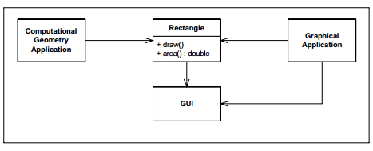
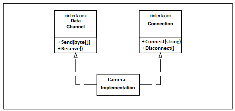

单一职责原则（Single Responsibility Principle）

## 1 单一职责原则

>（SRP：The Single Responsibility Principle）

### 为什么

- 因为每一个职责都是一个变化的中心。当需求变化时，这个变化将通过更改职责相关的类来体现。

- 如果一个类拥有多于一个的职责，则这些职责就耦合到在了一起，那么就会有多于一个原因来导致这个类的变化。对于某一职责的更改可能会损害类满足其他耦合职责的能力。这样职责的耦合会导致设计的脆弱，以至于当职责发生更改时产生无法预期的破坏。

### 是什么

> 一个类应该有且只有一个变化的原因。
> 
> **There should never be more than one reason for a class to change.**


## 2 实例
- 例如，考虑下图中的设计。类图中显示 Rectangle 类包含两个方法，一个方法（Draw）负责在显示屏幕上绘制矩形，另一个方法（Area）负责计算矩形图形面积。



- 有两个不同的应用程序均使用了 Rectangle 类。一个应用为计算几何程序，它使用了 Rectangle 中的数学几何模型，但不会在显示屏幕上绘制矩形。另一个应用是一个图形界面程序（GUI），它可能会做一些计算几何方面的工作，但主要功能是在屏幕上绘制矩形。
- 这个设计侵犯了 SRP 原则。Rectangle类包含了两个职责。第一个职责是提供矩形几何计算的数学模型，第二个职责是在 GUI上渲染矩形。

对 SRP 原则的侵犯会导致诸多难以解决的问题：

1. 首先，我们必须在计算几何应用中包含对 GUI库的引用。这导致应用程序无谓的消耗了链接时间、编译时间、内存空间和存储空间等。

2. 再者，如果因为某些原因对 GraphicalApplication 的一个更改导Rectangle类也相应做了更改，这将强制我们对 ComputationalGeometryApplication进行重新编译、重新测试和重新部署等。如果我们忘了做这些事情，那么应用程序可能以无法预期的方式而崩溃。


一个较好的设计是将这两个职责完全地隔离到不同的类当中：
* 这个设计将Rectangle 中关于几何计算的职责移到了 GeometricRectangle 类中，而 Rectangle类中仅保留矩形渲染职责。


* 然后，如果我们再对 Rectangle 中渲染职责进行更改时将不会再影响到ComputationalGeometryApplication 了。


## 3 职责（Responsibility）

### 概念
**单一职责原则（SRP：Single Responsibility Principle）** 的概念中，我们将职责（Responsibility）定义为"**一个变化的原因（a reason for change）**"。如果你能想出多于一种动机来更改一个类，则这个类就包含多于一个职责。

职责的耦合有时很难被发现，因为我们习惯于将多个职责一起来考虑。例如，我们考虑下面定义的Camera 接口，可能会认为这个接口看起来是非常合理的。接口中声明的 4个方法从属于一个 Camera 接口定义。

```
1   public interface Camera
2   {
3     void Connect(string host);
4     void Disconnect();
5     void Send(byte[] data);
6     byte[] Receive();
7   }
```

然而，它确实耦合了 2 个职责。第一个职责是连接管理，第二个职责是数据通信。Connect和 Disconnect 方法负责管理 Camera 与管理端 Host 的连接，而 Send 和 Receive方法则负责收发通信数据。

这两个职责应该被分离吗？答案基本上是肯定的。这两组方法基本上没有任何交集，它们都可以依据不同的原因而变化。进一步说，它们将在应用程序中完全不同的位置被调用，而那些不同的位置将同样会因不同的原因而变化。

因此，下图中的设计可能会好一些。它将这两个职责分别隔离到不同的接口定义中，这至少使应用程序从两个职责中解耦。



然而，我们注意到这两个职责又重新被耦合进了一CameraImplementation
类中。这可能不是我们想要的，但却有可能是必须的。通常有很多原因会强制我们将一些职责耦合在一起。尽管如此，我们使得应用程序的其他部分得益于这个接口的隔离。

CameraImplementation类在我们看来是一个组合出来的但确实包含一些缺点的类。但需要注意到的是，所有其他需要使用CameraImplementation类的地方已经可以被接口进行隔离，我们仅需依赖所定义的单一职责的接口。而CameraImplementation仅在被实例化的位置才会出现。我们将丑陋的代码限制在一定的范围内，而不会泄露或污染应用程序的其他部分。

## 4 总结

单一职责原则（SRP：Single Responsibility Principle）可表述为
"一个类应该有且只有一个变化的原因（There should never be more than one reason for a class to change.）"。单一职责原则是一个非常简单的原则，但通常也是最难做的正确的一个原则。职责的联合是在实践中经常碰到的事情，从这些各不相同的职责中发现并隔离职责就是软件设计的真谛所在。我们所讨论的其他设计原则最终也会回归到这个原则上来。


