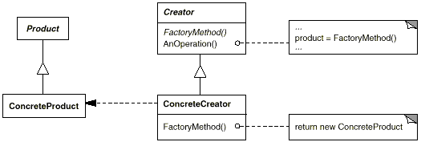

**别名**

-   虚构造器 （Virtual Constructor）

**意图**

定义一个用于创建目标对象的接口，让子类决定实例化哪一个目标类。

Factory Method 使一个类的实例化延迟到其子类。

Define an interface for creating an object, but let subclasses decide which
class to instantiate.

Factory Method lets a class defer instantiation to subclasses.

**结构**




**参与者**

Product

-   定义工厂方法所创建的对象的接口（Interface）。

ConcreteProduct

-   实现 Product 接口。

Creator

-   声明工厂方法，该方法返回一个 Product 类型的对象。 Creator
    也可以定义一个工厂方法的缺省实现，它返回一个缺省的 ConcreteProduct 对象。

-   可以调用工厂方法以创建一个 Product 对象。

ConcreteCreator

-   重定义（Override）工厂方法以创建一个 Product 对象。

**适用性**

在下列情况下可以使用 Factory Method 模式：

-   当一个类不知道它所必须创建的对象的类的时候。

-   当一个类希望由它的子类来指定它所创建的对象的时候。

-   当类将创建对象的职责委托给多个帮助子类中的某一个，并且你希望将哪一个帮助子类是代理者这一信息局部化的时候。

**缺点**

-   客户可能仅仅为了创建一个特定的 ConcreteProduct 对象，就不得不创建 Creator
    的子类。

**效果**

-   为子类提供挂钩

-   连接平行的类层次

**相关模式**

-   Abstract Factory 经常用工厂方法来实现。

-   Factory Method 通常在 [Template
    Method](http://www.cnblogs.com/gaochundong/p/design_pattern_template_method.html)
    中被调用。

-   Prototype 不需要创建 Creator 的子类。但是，它们通常要求一个针对 Product 类的
    Initialize 操作。Creator 使用 Initialize 来初始化对象，而 Factory Method
    不需要这样的操作。

**命名约定**

使用命名约定是一个好习惯，它可以清楚地说明你正在使用工厂方法。（Convention over
Configuration）

例如，总是声明那些定义为工厂方法的抽象操作为 CreateProduct()。


## Implementation

```java
public abstract class Factory {
    abstract public Product factoryMethod();
    public void doSomething() {
        Product product = factoryMethod();
        // do something with the product
    }
}
```

```java
public class ConcreteFactory extends Factory {
    public Product factoryMethod() {
        return new ConcreteProduct();
    }
}
```

```java
public class ConcreteFactory1 extends Factory {
    public Product factoryMethod() {
        return new ConcreteProduct1();
    }
}
```

```java
public class ConcreteFactory2 extends Factory {
    public Product factoryMethod() {
        return new ConcreteProduct2();
    }
}
```

### JDK

- [java.util.Calendar](http://docs.oracle.com/javase/8/docs/api/java/util/Calendar.html#getInstance--)
- [java.util.ResourceBundle](http://docs.oracle.com/javase/8/docs/api/java/util/ResourceBundle.html#getBundle-java.lang.String-)
- [java.text.NumberFormat](http://docs.oracle.com/javase/8/docs/api/java/text/NumberFormat.html#getInstance--)
- [java.nio.charset.Charset](http://docs.oracle.com/javase/8/docs/api/java/nio/charset/Charset.html#forName-java.lang.String-)
- [java.net.URLStreamHandlerFactory](http://docs.oracle.com/javase/8/docs/api/java/net/URLStreamHandlerFactory.html#createURLStreamHandler-java.lang.String-)
- [java.util.EnumSet](https://docs.oracle.com/javase/8/docs/api/java/util/EnumSet.html#of-E-)
- [javax.xml.bind.JAXBContext](https://docs.oracle.com/javase/8/docs/api/javax/xml/bind/JAXBContext.html#createMarshaller--)
