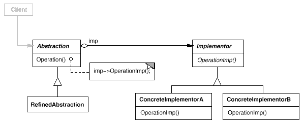

## 桥接
**别名**

-   Handle

-   Body

**意图**

将抽象部分与它的实现部分分离，使它们都可以独立地变化。

Decouple an abstraction from its implementation so that the two can vary
independently.

**结构**



**参与者**

Abstraction

-   定义抽象类的接口。

-   维护一个指向 Implementor 类型对象的指针。

RefinedAbstraction

-   扩充由 Abstraction 定义的接口。

Implementor

-   定义实现类的接口，该接口不一定要与 Abstraction
    接口完全一致，甚至可以完全不同。

-   Implementor 接口仅提供基本操作，Abstraction
    则定义了基于这些基本操作的较高层次的操作。

ConcreteImplementor

-   实现 Implementor 接口并定义它的具体实现。

**适用性**

在以下情况下可以使用 Bridge 模式：

-   你不希望在抽象和它的实现部分之间有一个固定的绑定关系。比如需要在程序运行时刻实现部分应可以被选择或者切换。

-   类的抽象以及它的实现都应该可以通过生成子类的方法加以扩充。

-   对一个抽象的实现部分的修改应对客户不产生影响，即客户的代码不必重新编译。

-   你想对客户完全隐藏抽象的实现部分。

-   类的层次需要将一个对象分解成两个部分。

-   你想在多个对象间共享实现，但同时要求客户并不知道这一点。

**效果**

-   分离接口及其实现部分。

-   提高可扩充性。

-   实现细节对客户透明。

**相关模式**

-   Abstract Factory 模式可以用来创建和配置一个特定的 Bridge 模式。

-   Adaptor
    模式用来帮助无关的类协同工作，它通常在系统设计完成后才会被使用。Bridge
    模式则是在系统开始时就被使用，它使得抽象接口和实现部分可以独立进行改变。

-   Bridge 模式的结构与对象 Adapter 模式类似，但是 Bridge
    模式的出发点不同：Bridge
    目的是将接口部分和实现部分分离，从而对它们可以较为容易也相对独立的加以改变。而
    Adapter 则意味着改变一个已有对象的接口。


## Implementation

RemoteControl 表示遥控器，指代 Abstraction。

TV 表示电视，指代 Implementor。

桥接模式将遥控器和电视分离开来，从而可以独立改变遥控器或者电视的实现。

```java
public abstract class TV {
    public abstract void on();

    public abstract void off();

    public abstract void tuneChannel();
}
```

```java
public class Sony extends TV {
    @Override
    public void on() {
        System.out.println("Sony.on()");
    }

    @Override
    public void off() {
        System.out.println("Sony.off()");
    }

    @Override
    public void tuneChannel() {
        System.out.println("Sony.tuneChannel()");
    }
}
```

```java
public class RCA extends TV {
    @Override
    public void on() {
        System.out.println("RCA.on()");
    }

    @Override
    public void off() {
        System.out.println("RCA.off()");
    }

    @Override
    public void tuneChannel() {
        System.out.println("RCA.tuneChannel()");
    }
}
```

```java
public abstract class RemoteControl {
    protected TV tv;

    public RemoteControl(TV tv) {
        this.tv = tv;
    }

    public abstract void on();

    public abstract void off();

    public abstract void tuneChannel();
}
```

```java
public class ConcreteRemoteControl1 extends RemoteControl {
    public ConcreteRemoteControl1(TV tv) {
        super(tv);
    }

    @Override
    public void on() {
        System.out.println("ConcreteRemoteControl1.on()");
        tv.on();
    }

    @Override
    public void off() {
        System.out.println("ConcreteRemoteControl1.off()");
        tv.off();
    }

    @Override
    public void tuneChannel() {
        System.out.println("ConcreteRemoteControl1.tuneChannel()");
        tv.tuneChannel();
    }
}
```

```java
public class ConcreteRemoteControl2 extends RemoteControl {
    public ConcreteRemoteControl2(TV tv) {
        super(tv);
    }

    @Override
    public void on() {
        System.out.println("ConcreteRemoteControl2.on()");
        tv.on();
    }

    @Override
    public void off() {
        System.out.println("ConcreteRemoteControl2.off()");
        tv.off();
    }

    @Override
    public void tuneChannel() {
        System.out.println("ConcreteRemoteControl2.tuneChannel()");
        tv.tuneChannel();
    }
}
```

```java
public class Client {
    public static void main(String[] args) {
        RemoteControl remoteControl1 = new ConcreteRemoteControl1(new RCA());
        remoteControl1.on();
        remoteControl1.off();
        remoteControl1.tuneChannel();
        RemoteControl remoteControl2 = new ConcreteRemoteControl2(new Sony());
         remoteControl2.on();
         remoteControl2.off();
         remoteControl2.tuneChannel();
    }
}
```

### JDK

- AWT (It provides an abstraction layer which maps onto the native OS the windowing support.)
- JDBC
