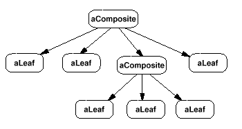

## 组合模式

**意图**

将对象组合成树形结构以表示 “部分-整体” 的层次结构。

Composite 使得用户对于单个对象和组合对象的使用具有一致性。

Compose objects into tree structures to represent part-whole hierarchies.

Composite lets clients treat individual objects and compositions of objects
uniformly.

**结构**


典型的 Composite 对象结构：



**参与者**

Component

-   为组合中的对象声明接口。

-   在适当的情况下，实现所有类共有接口的缺省行为

-   声明一个接口用于访问和管理 Component 的子组件。

-   在递归结构中定义一个接口，用于访问一个父部件，并在合适的情况下实现它。

Leaf

-   在组合中表示叶节点对象，叶节点没有子节点。

-   在组合中定义图元对象的行为。

Composite

-   定义有子部件的那些部件的行为。

-   在 Composite 接口中实现与子部件有关的操作。

Client

-   通过 Component 接口操纵组合部件的对象。

**适用性**

在以下情况下可以使用 Composite 模式：

-   你想表示对象的 “部分-整体” 层次结构。

-   你希望用户忽略组合对象与单个对象的不同，用户将统一地使用组合结构中的所有对象。

**缺点**

-   与类层次结构设计原则冲突

Composite 模式的目的之一是使得用户不知道它们正在使用具体的 Leaf 和 Composite
类。

为达到这一目的，Component 需要为 Leaf 和 Composite
定义一些公共操作，并提供缺省的实现，而 Leaf 和 Composite
子类可以对它们进行重定义。

然而，这个目标会与类层次结构设计原则冲突，该原则规定：一个类只能定义那些对它的子类有意义的操作。

**效果**

-   定义了包含基本对象和组合对象的类层次结构。

-   简化客户代码。

-   使得更容易增加新类型的组件。

-   使你的设计变得更加一般化。

**相关模式**

-   Command 模式描述了如何用一个 MacroCommand Composite 类组成一些 Command
    对象，并对它们进行排序。

-   通常 “部件-父部件” 连接用于 Responsibility of Chain 模式。

-   Decorator 模式经常与 Composite 模式一起使用。它们通常有一个公共的父类。

-   Flyweight 让你共享组件，但不再能引用它们的父部件。

-   Iterator 可以用来遍历 Composite。

-   Visitor 将本来应该分布在 Composite 和 Leaf 类中的操作和行为局部化。


### Implementation

```java
public abstract class Component {
    protected String name;

    public Component(String name) {
        this.name = name;
    }

    public void print() {
        print(0);
    }

    abstract void print(int level);

    abstract public void add(Component component);

    abstract public void remove(Component component);
}
```

```java
public class Composite extends Component {

    private List<Component> child;

    public Composite(String name) {
        super(name);
        child = new ArrayList<>();
    }

    @Override
    void print(int level) {
        for (int i = 0; i < level; i++) {
            System.out.print("--");
        }
        System.out.println("Composite:" + name);
        for (Component component : child) {
            component.print(level + 1);
        }
    }

    @Override
    public void add(Component component) {
        child.add(component);
    }

    @Override
    public void remove(Component component) {
        child.remove(component);
    }
}
```

```java
public class Leaf extends Component {
    public Leaf(String name) {
        super(name);
    }

    @Override
    void print(int level) {
        for (int i = 0; i < level; i++) {
            System.out.print("--");
        }
        System.out.println("left:" + name);
    }

    @Override
    public void add(Component component) {
        throw new UnsupportedOperationException(); // 牺牲透明性换取单一职责原则，这样就不用考虑是叶子节点还是组合节点
    }

    @Override
    public void remove(Component component) {
        throw new UnsupportedOperationException();
    }
}
```

```java
public class Client {
    public static void main(String[] args) {
        Composite root = new Composite("root");
        Component node1 = new Leaf("1");
        Component node2 = new Composite("2");
        Component node3 = new Leaf("3");
        root.add(node1);
        root.add(node2);
        root.add(node3);
        Component node21 = new Leaf("21");
        Component node22 = new Composite("22");
        node2.add(node21);
        node2.add(node22);
        Component node221 = new Leaf("221");
        node22.add(node221);
        root.print();
    }
}
```

```html
Composite:root
--left:1
--Composite:2
----left:21
----Composite:22
------left:221
--left:3
```

### JDK

- javax.swing.JComponent#add(Component)
- java.awt.Container#add(Component)
- java.util.Map#putAll(Map)
- java.util.List#addAll(Collection)
- java.util.Set#addAll(Collection)
