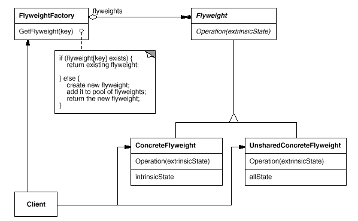

**意图**

运用共享技术有效地支持大量细粒度的对象。

Use sharing to support large numbers of fine-grained objects efficiently.

**结构**



下面的对象图说明了如何共享 Flyweight：


**参与者**

Flyweight

-   描述一个接口，通过这个接口 Flyweight 可以接受并作用于外部状态。

ConcreteFlyweight

-   实现 Flyweight
    接口，并为内部状态增加存储空间。该对象必须是可共享的。它所存储的状态必须是内部的，即必须独立于对象的场景。

UnsharedConcreteFlyweight

-   并非所有的 Flyweight 子类都需要被共享。Flyweight
    接口使共享成为可能，但它并不强制共享。

FlyweightFactory

-   创建并管理 Flyweight 对象。

-   确保合理地共享 Flyweight。

Client

-   维持一个对 Flyweight 的引用。

-   计算或存储 Flyweight 的外部状态。

**适用性**

Flyweight 模式的有效性很大程度上取决于如何使用它以及在何处使用它。

当以下情况成立时可以使用 Flyweight 模式：

-   一个应用程序使用了大量的对象。

-   完全由于使用大量对象，造成很大的存储开销。

-   对象的大多数状态都可变为外部状态。

-   如果删除对象的外部状态，那么可以用相对较少的共享对象取代很多组对象。

-   应用程序不依赖于对象标识。

**效果**

-   存储空间上的节省抵消了传输、查找和计算外部状态时的开销。节约量随着共享状态的增多而增大。

**相关模式**

-   Flyweight 模式通常和 Composite
    模式结合起来，用共享叶节点的又向无环图实现一个逻辑上的层次结构。

-   通常，最好用 Flyweight 实现 State 和 Strategy 对象。


## Implementation

```java
public interface Flyweight {
    void doOperation(String extrinsicState);
}
```

```java
public class ConcreteFlyweight implements Flyweight {

    private String intrinsicState;

    public ConcreteFlyweight(String intrinsicState) {
        this.intrinsicState = intrinsicState;
    }

    @Override
    public void doOperation(String extrinsicState) {
        System.out.println("Object address: " + System.identityHashCode(this));
        System.out.println("IntrinsicState: " + intrinsicState);
        System.out.println("ExtrinsicState: " + extrinsicState);
    }
}
```

```java
public class FlyweightFactory {

    private HashMap<String, Flyweight> flyweights = new HashMap<>();

    Flyweight getFlyweight(String intrinsicState) {
        if (!flyweights.containsKey(intrinsicState)) {
            Flyweight flyweight = new ConcreteFlyweight(intrinsicState);
            flyweights.put(intrinsicState, flyweight);
        }
        return flyweights.get(intrinsicState);
    }
}
```

```java
public class Client {

    public static void main(String[] args) {
        FlyweightFactory factory = new FlyweightFactory();
        Flyweight flyweight1 = factory.getFlyweight("aa");
        Flyweight flyweight2 = factory.getFlyweight("aa");
        flyweight1.doOperation("x");
        flyweight2.doOperation("y");
    }
}
```

```html
Object address: 1163157884
IntrinsicState: aa
ExtrinsicState: x
Object address: 1163157884
IntrinsicState: aa
ExtrinsicState: y
```

### JDK

Java 利用缓存来加速大量小对象的访问时间。

- java.lang.Integer#valueOf(int)
- java.lang.Boolean#valueOf(boolean)
- java.lang.Byte#valueOf(byte)
- java.lang.Character#valueOf(char)
