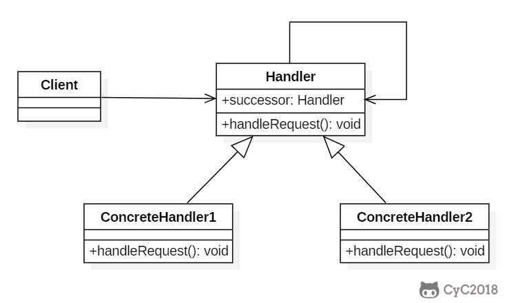

**意图**

使多个对象都有机会处理请求，从而避免请求的发送者和接收者之间的耦合关系。

将这些对象连成一条链，并沿着这条链传递该请求，直到有一个对象处理它位置。

Avoid coupling the sender of a request to its receiver by giving more than one
object a chance to handle the request.

Chain the receiving objects and pass the request along the chain until an object
handles it.

**结构**


一个典型的对象结构可能如下图所示：



**参与者**

Handler

-   定义一个处理请求的接口。

-   实现后继链

ConcreteHandler

-   处理它所负责的请求。

-   可访问它的后继者。

-   如果可处理该请求，就处理；否则将该请求转发给它的后继者。

Client

-   向链上的具体处理者对象提交请求。

**适用性**

在以下情况下可以使用 Chain of Responsibility 模式：

-   有多个对象可以处理一个请求，哪个对象处理该请求运行时自动确定。

-   你想在不明确指定接收者的情况下，向多个对象中的一个提交一个请求。

-   可处理一个请求的对象集合应被动态指定。

**效果**

-   降低耦合度。对象无需知道哪个一个对象处理其请求，仅需知道对象被处理。

-   增强了给对象指派职责的灵活性。可以运行时对该链进行动态增加或修改。

**相关模式**

-   Chain of Resposibility 常与 Composite
    一起使用。一个构件的父构件可作为它的后继。


### Implementation

```java
public abstract class Handler {

    protected Handler successor;


    public Handler(Handler successor) {
        this.successor = successor;
    }


    protected abstract void handleRequest(Request request);
}
```

```java
public class ConcreteHandler1 extends Handler {

    public ConcreteHandler1(Handler successor) {
        super(successor);
    }


    @Override
    protected void handleRequest(Request request) {
        if (request.getType() == RequestType.TYPE1) {
            System.out.println(request.getName() + " is handle by ConcreteHandler1");
            return;
        }
        if (successor != null) {
            successor.handleRequest(request);
        }
    }
}
```

```java
public class ConcreteHandler2 extends Handler {

    public ConcreteHandler2(Handler successor) {
        super(successor);
    }


    @Override
    protected void handleRequest(Request request) {
        if (request.getType() == RequestType.TYPE2) {
            System.out.println(request.getName() + " is handle by ConcreteHandler2");
            return;
        }
        if (successor != null) {
            successor.handleRequest(request);
        }
    }
}
```

```java
public class Request {

    private RequestType type;
    private String name;


    public Request(RequestType type, String name) {
        this.type = type;
        this.name = name;
    }


    public RequestType getType() {
        return type;
    }


    public String getName() {
        return name;
    }
}

```

```java
public enum RequestType {
    TYPE1, TYPE2
}
```

```java
public class Client {

    public static void main(String[] args) {

        Handler handler1 = new ConcreteHandler1(null);
        Handler handler2 = new ConcreteHandler2(handler1);

        Request request1 = new Request(RequestType.TYPE1, "request1");
        handler2.handleRequest(request1);

        Request request2 = new Request(RequestType.TYPE2, "request2");
        handler2.handleRequest(request2);
    }
}
```

```html
request1 is handle by ConcreteHandler1
request2 is handle by ConcreteHandler2
```

### JDK

- [java.util.logging.Logger#log()](http://docs.oracle.com/javase/8/docs/api/java/util/logging/Logger.html#log%28java.util.logging.Level,%20java.lang.String%29)
- [Apache Commons Chain](https://commons.apache.org/proper/commons-chain/index.html)
- [javax.servlet.Filter#doFilter()](http://docs.oracle.com/javaee/7/api/javax/servlet/Filter.html#doFilter-javax.servlet.ServletRequest-javax.servlet.ServletResponse-javax.servlet.FilterChain-)
