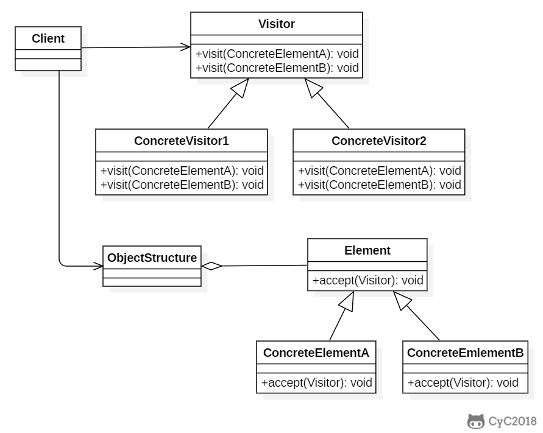

**意图**

表示一个作用于某对象结构中的各元素的操作。

Visitor 使你可以在不改变各元素的类的前提下定义作用于这些元素的新操作。

Represent an operation to be performed on the elements of an object structure.

Visitor lets you define a new operation without changing the classes of the
elements on which it operates.

**结构**




**参与者**

Visitor

-  为该对象结构中 ConcreteElement 的每一个类声明一个 Visit
    操作。该操作的名字和特征标识了发送 Visit 请求给该访问者的那个类。

ConcreteVisitor

-  实现每个由 Visitor 声明的操作。

Element

-  定义一个 Accept 操作，它以一个 Visitor 为参数。

ConcreteElement

-  实现 Accept 操作，该操作以一个 Visitor 为参数。

ObjectStructure

-  能枚举 Element。

-  可以提供一个高层的接口以允许该 Visitor 访问它的元素。

-  可以是一个 Composite 或是一个集合、列表或无序集合。

**适用性**

在以下情况下可以使用 Visitor 模式：

-  一个对象结构包含很多类操作，它们有不同的接口，而你想对这些对象实施一些依赖于其具体类的操作。

-  需要对一个对象结构中的对象进行很多不同的并且不相关的操作，而你想避免让这些操作污染这些对象的类。

-  定义对象结构的类很少改变，但经常需要在此结构上定义新的操作。

**缺点**

-  增加新的 ConcreteElement 类很困难。添加新的 ConcreteElement 都要在 Visitor
    中添加一个新的抽象操作。

-  可能破坏封装。Visitor 假定 ConcreteElement 接口的功能足够强，足以让 Visitor
    进行它的工作。但有时会迫使你提供 ConcreteElement 的内部状态的公共操作。

**效果**

-  Visitor 模式使得易于增加新的操作。

-  Visitor 集中相关的操作而分离无关的操作。

**相关模式**

-  Visitor 可以用于对一个 Composite 模式定义的对象结构进行操作。

-  Visitor 可以用于 Interpreter 解释。


## Implementation

```java
public interface Element {
    void accept(Visitor visitor);
}
```

```java
class CustomerGroup {

    private List<Customer> customers = new ArrayList<>();

    void accept(Visitor visitor) {
        for (Customer customer : customers) {
            customer.accept(visitor);
        }
    }

    void addCustomer(Customer customer) {
        customers.add(customer);
    }
}
```

```java
public class Customer implements Element {

    private String name;
    private List<Order> orders = new ArrayList<>();

    Customer(String name) {
        this.name = name;
    }

    String getName() {
        return name;
    }

    void addOrder(Order order) {
        orders.add(order);
    }

    public void accept(Visitor visitor) {
        visitor.visit(this);
        for (Order order : orders) {
            order.accept(visitor);
        }
    }
}
```

```java
public class Order implements Element {

    private String name;
    private List<Item> items = new ArrayList();

    Order(String name) {
        this.name = name;
    }

    Order(String name, String itemName) {
        this.name = name;
        this.addItem(new Item(itemName));
    }

    String getName() {
        return name;
    }

    void addItem(Item item) {
        items.add(item);
    }

    public void accept(Visitor visitor) {
        visitor.visit(this);

        for (Item item : items) {
            item.accept(visitor);
        }
    }
}
```

```java
public class Item implements Element {

    private String name;

    Item(String name) {
        this.name = name;
    }

    String getName() {
        return name;
    }

    public void accept(Visitor visitor) {
        visitor.visit(this);
    }
}
```

```java
public interface Visitor {
    void visit(Customer customer);

    void visit(Order order);

    void visit(Item item);
}
```

```java
public class GeneralReport implements Visitor {

    private int customersNo;
    private int ordersNo;
    private int itemsNo;

    public void visit(Customer customer) {
        System.out.println(customer.getName());
        customersNo++;
    }

    public void visit(Order order) {
        System.out.println(order.getName());
        ordersNo++;
    }

    public void visit(Item item) {
        System.out.println(item.getName());
        itemsNo++;
    }

    public void displayResults() {
        System.out.println("Number of customers: " + customersNo);
        System.out.println("Number of orders:    " + ordersNo);
        System.out.println("Number of items:     " + itemsNo);
    }
}
```

```java
public class Client {
    public static void main(String[] args) {
        Customer customer1 = new Customer("customer1");
        customer1.addOrder(new Order("order1", "item1"));
        customer1.addOrder(new Order("order2", "item1"));
        customer1.addOrder(new Order("order3", "item1"));

        Order order = new Order("order_a");
        order.addItem(new Item("item_a1"));
        order.addItem(new Item("item_a2"));
        order.addItem(new Item("item_a3"));
        Customer customer2 = new Customer("customer2");
        customer2.addOrder(order);

        CustomerGroup customers = new CustomerGroup();
        customers.addCustomer(customer1);
        customers.addCustomer(customer2);

        GeneralReport visitor = new GeneralReport();
        customers.accept(visitor);
        visitor.displayResults();
    }
}
```

```html
customer1
order1
item1
order2
item1
order3
item1
customer2
order_a
item_a1
item_a2
item_a3
Number of customers: 2
Number of orders:    4
Number of items:     6
```

### JDK

- javax.lang.model.element.Element and javax.lang.model.element.ElementVisitor
- javax.lang.model.type.TypeMirror and javax.lang.model.type.TypeVisitor
